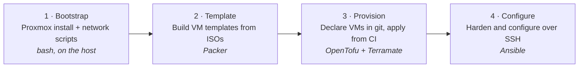

<div align="center">

# Autolab

**A learning-first homelab you build yourself: Proxmox bootstrap, then infrastructure as code, CI, and a reusable Linux server baseline.**

[Get started](#get-started) · [How it works](#how-it-works) · [Status](#status) · [Docs](docs/README.md) · [Roadmap](docs/ROADMAP.md) · [Contributing](CONTRIBUTING.md)

[](https://github.com/megamp15/AUTOLAB/actions/workflows/90_scripts.yml)
[](https://github.com/megamp15/AUTOLAB/actions/workflows/98_opentofu-ci.yml)
[](docs/ROADMAP.md)
[](https://www.proxmox.com/)
[](LICENSE)

</div>

---

Autolab turns one spare machine (a laptop with a USB Ethernet adapter is enough) into a Proxmox hypervisor with predictable networking, then grows it into a small GitOps-managed lab. Every step is documented so you understand *why*, not just what to paste. Secrets and site-specific values stay on the host or in GitHub secrets, never in git, so the same repo works on your second box.

> **How is this different from "homelab in a box" repos?**
> Projects like [khuedoan/homelab](https://github.com/khuedoan/homelab) target multi-node Kubernetes and a large app catalog. Autolab starts smaller: one Proxmox host, reproducible networking with Wi-Fi failover, and tutorials you can fork for your own hardware. Same idea (IaC, learn by doing), narrower scope.

## How it works

Autolab is split into layers by *when* each one can run and what it depends on.



| Layer | What it does | Runs where | Lives in |
|-------|--------------|------------|----------|
| **Bootstrap** | Install Proxmox, configure USB Ethernet + Wi-Fi failover, join Tailscale | On the host, manually | [`docs/proxmox/`](docs/proxmox/) |
| **Template** | Build Debian / Ubuntu cloud-init VM templates | GitHub Actions over Tailscale | [`infra/packer/`](infra/packer/) |
| **Provision** | Create VMs from a committed machine map, state in Cloudflare R2 | GitHub Actions over Tailscale | [`infra/`](infra/) |
| **Configure** | Users, SSH hardening, firewall, updates, optional Docker | GitHub Actions via Tailscale SSH | [`builders/ansible/`](builders/ansible/) |

The bootstrap layer is manual on purpose: you cannot GitOps your way onto a host that has no working uplink yet. Everything after it is driven from git. A future VPS track skips the first two layers and reuses the last two.

## Get started

### 1. Bootstrap the Proxmox host

Follow [Install Proxmox](docs/proxmox/01-bare-metal-install.md), then copy the scripts to the host and run the network wizard:

```bash
# On your laptop
scp -r ./docs/proxmox/* root@PROXMOX_IP:/root/proxmox-setup/

# On the Proxmox host, as root
cd /root/proxmox-setup/scripts
bash configure-proxmox-network-env.sh     # writes /etc/default/proxmox-network.env
bash setup-proxmox-network.sh --apply     # interfaces, wpa_supplicant, failover, vmbr0-watch
```

Full walkthrough: [00 · Network over SSH](docs/proxmox/00-fresh-install-network.md). Add `--dry-run` to either script to preview changes first.

> **Heads up.** These scripts rewrite network config and may drop your SSH session briefly. Keep a local console or a second path (Tailscale) available. A backup is written to `/root/proxmox-network-backup-*` before apply.

### 2. Wire up GitOps

Once the host is on Tailscale, work through the [phase 2 setup checklist](docs/gitops/setup-checklist.md). It covers the Tailscale CI identity, Proxmox API token, R2 state bucket, and GitHub environments. After that, the numbered workflows run in order from the Actions tab:

| Workflow | Purpose |
|----------|---------|
| `01 · Bootstrap private VM network` | One-time `vmbr1` + NAT for Wi-Fi-only hosts |
| `02 · Packer Build` | Build a VM template from the [catalog](infra/packer/template-catalog.yaml) |
| `03 · OpenTofu Plan` / `04 · Apply` | Plan and apply the `lab` stack |
| `05 · Ansible Builder` | Harden VMs; run `docker` or `tailscale-update` on demand |
| `99 · OpenTofu Destroy` | Tear the stack down, cleaning Tailscale device records |

`90 · Scripts` and `98 · OpenTofu CI` run automatically on push and pull request.

## Status

Autolab is **alpha**. The bootstrap path is used on real hardware; the GitOps layers run end-to-end against a single lab VM.

| Phase | Scope | State |
|-------|-------|-------|
| 1 · Bootstrap | Install guide, network wizard, USB Ethernet + Wi-Fi failover, APT and Tailscale runbooks | Usable |
| 2A · Provision | OpenTofu modules, Terramate stacks, R2 backend, plan / apply / destroy workflows, committed `lab` machine map | Usable |
| 2B · Template | Packer catalog: `debian-13` and `ubuntu-24.04` implemented, `ubuntu-26.04` blocked on an upstream ISO fix | Usable |
| 2C · Configure | Ansible baseline (users, SSH, firewall, updates, `gitops` user), opt-in Docker, Tailscale SSH transport | Usable |
| VPS track | Cloud-provider stacks that reuse the configure layer | Planned |
| Service tutorials | Guides for running things on the lab | Planned |

Design decisions are recorded as ADRs in [`docs/adr/`](docs/adr/). Quality gates are in [production-readiness.md](docs/production-readiness.md).

## Design principles

- **Learn by doing.** Every guide explains the reasoning, not only the commands.
- **Bootstrap first, GitOps after.** The host gets online manually; automation takes over once it can reach GitHub.
- **Host-only secrets.** Wi-Fi passwords, IPs, and tokens live on the host or in GitHub secrets. The repo stays generic.
- **Schema-driven.** Connection, Packer, and network-env fields are defined once in YAML and generated into OpenTofu, Packer, bash, and CI adapters. Drift fails CI.
- **Provider-neutral baseline.** Once a Linux host is reachable over SSH, the same Ansible roles apply whether it came from Proxmox or a VPS.

## Repository layout

```text
docs/proxmox/      Bootstrap guides + the bash scripts that run on the host
docs/gitops/       Tailscale, runner, API token, R2, environments, template lifecycle
docs/adr/          Architecture decision records
infra/             Terramate + OpenTofu stacks and modules
infra/packer/      Packer template catalog and per-OS builds
builders/ansible/  Provider-neutral server baseline (roles + playbooks)
scripts/           Schema generators, R2 setup, Tailscale device cleanup, tests
.github/           Numbered workflows and composite actions
```

## Contributing

Issues and pull requests are welcome. See [CONTRIBUTING.md](CONTRIBUTING.md) for the local checks CI expects and the schema-first workflow for generated files.

## License

[MIT](LICENSE)
