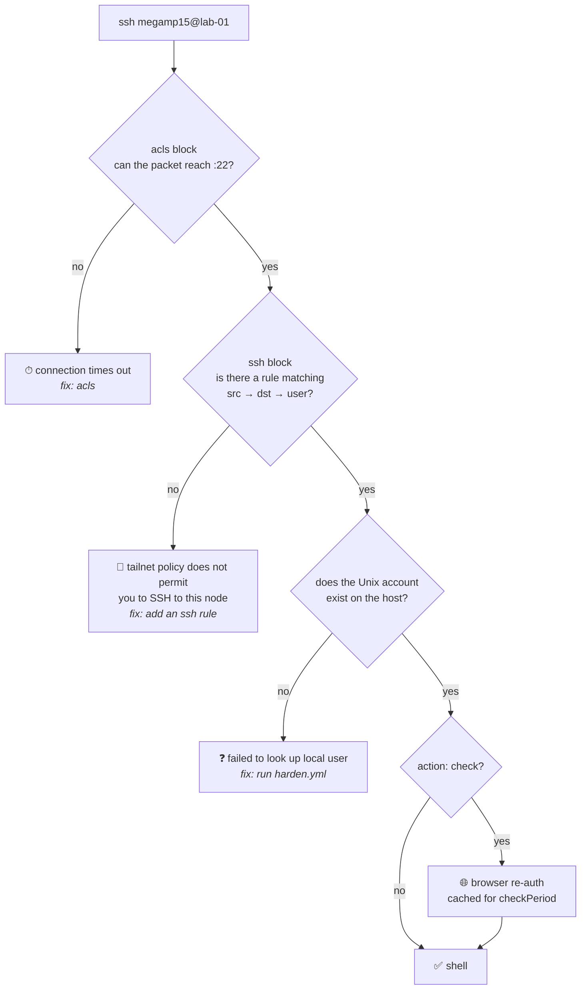
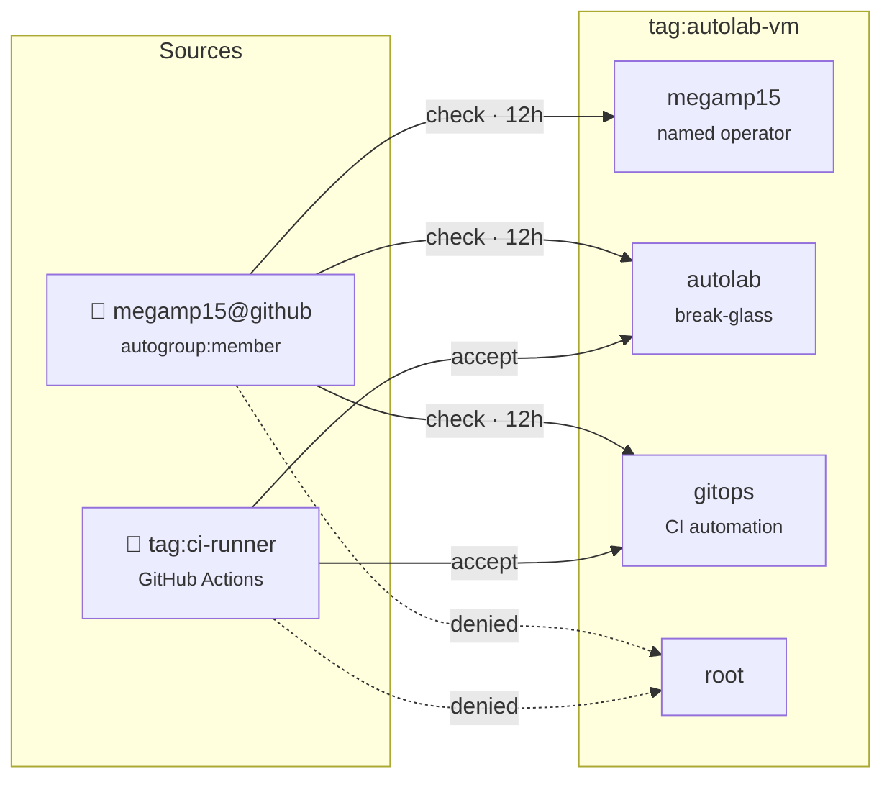

# Step 1 - Tailscale SSH

Proxmox is joined to Tailscale during phase 1. Builder VMs enroll during
cloud-init, then cloud-init enables their Tailscale SSH host feature. The
approved Builder transport is Tailscale SSH for both bootstrap and regular
automation; do not add or reuse a VM SSH key for CI.

## Enable Tailscale SSH on a Linux host

Verify enrollment and the host feature:

```bash
tailscale status
tailscale ip -4
```

The first Builder connection is as `autolab`; after `harden.yml` creates the
account, regular runs use `gitops`:

```bash
tailscale ssh autolab@HOSTNAME
tailscale ssh gitops@HOSTNAME
```

`HOSTNAME` can be the MagicDNS name or the Tailscale IP.

## How a connection is authorised

Three independent gates. Each one is a different failure message, which is the
fastest way to tell them apart:



The middle two gates are the ones that bite. An allow-all `acls` block does
**not** grant SSH — `acls` governs reachability, the `ssh` block governs SSH,
and they are evaluated separately. And a policy rule for an account that does
not exist yet is inert: Tailscale only uses accounts already present on the
host, it never creates them.

## Who may reach what



`root` is denied on both paths and asserted denied in `sshTests`. That matters
because `ssh-hardening` writes `PermitRootLogin no` into `sshd_config`, which
Tailscale SSH bypasses entirely — the tailnet policy is the only thing keeping
root out.

## Tailnet policy

Tailscale SSH is controlled by the tailnet policy, not by VM `authorized_keys`.
The policy is configured manually by the tailnet administrator. Use exactly
`tag:ci-runner` for ephemeral CI runners and `tag:autolab-vm` for Builder VMs.
The runner needs a network grant to the VM tag and SSH accept rules limited to
`autolab` for bootstrap and `gitops` afterward. Never include `root`.

Two sources need SSH rules, and both must be written explicitly: the CI runner
and **you**. Neither is covered by the default policy — see the tagged-device
note below.

The tailnet policy file is HuJSON, so comments and trailing commas are valid.
Comment every rule — the `src`/`dst`/`users` triple does not say *why* a rule
exists, and these are security decisions someone will need to re-read later.

```jsonc
"ssh": [
    // Stock rule: members SSH into their OWN devices, in check mode.
    // Does NOT cover Builder VMs — they are tagged, so nobody owns them.
    {
        "action": "check",
        "src":    ["autogroup:member"],
        "dst":    ["autogroup:self"],
        "users":  ["autogroup:nonroot", "root"],
    },
    // Allow CI to SSH into Builder VMs. accept (not check): CI cannot
    // satisfy an interactive browser check. autolab bootstraps, gitops
    // runs afterward; never root.
    {
        "action": "accept",
        "src":    ["tag:ci-runner"],
        "dst":    ["tag:autolab-vm"],
        "users":  ["autolab", "gitops"],
    },
    // Allow members to SSH into Builder VMs for ad-hoc access. check mode
    // adds an IdP re-auth every 12h as a second factor. Never root: sshd's
    // PermitRootLogin does not apply to Tailscale SSH, so this list is the
    // only thing keeping root out. sudo -i covers the real need.
    {
        "action":      "check",
        "src":         ["autogroup:member"],
        "dst":         ["tag:autolab-vm"],
        "users":       ["autolab", "gitops"],
        "checkPeriod": "12h",
    },
],
```

### Tagged devices are never `autogroup:self`

The first rule above is what a new tailnet ships with, and it is the reason
this trips people up. `autogroup:self` means *devices owned by the connecting
user*. A Builder VM carries `tag:autolab-vm`, and **tagged devices have no user
owner** — the admin console shows their owner as `tagged-devices`. The default
rule therefore never matches a Builder VM, no matter who you are. Human access
must name the tag in `dst`, exactly like the CI rule does.

This fails in a confusing way. The admin console's per-machine *SSH quickstart*
reports "Tailscale SSH is already allowed by your policy file" because it only
checks that an `ssh` block exists, not that any rule matches the machine you are
looking at. An allow-all `acls` block does not help either: `acls` governs
network reachability, while Tailscale SSH is authorised *solely* by the `ssh`
block. The symptom of a missing rule is a connection that is accepted and then
refused:

```
tailscale: tailnet policy does not permit you to SSH to this node
```

A timeout instead of that message means an `acls` problem, not an `ssh` one.

### Why `check` for humans and `accept` for CI

`check` requires a browser re-authentication against your identity provider
before the session opens, cached for `checkPeriod` (default `12h`). It is a
second factor for interactive shell access, and it is deliberately not applied
to the runner: `check` cannot be satisfied non-interactively, so CI, `scp`,
and locally-run `ansible-playbook` need `accept`. Normal operation drives
Builder through GitHub Actions, so the interactive gate costs nothing there.

Use `accept` for the human rule too if you want ad-hoc scripting against lab
machines from a workstation.

### Never grant `root`, even though sshd forbids it

`ssh-hardening` writes `PermitRootLogin no`, but that governs `sshd` — which
Tailscale SSH bypasses entirely. Listing `root` in an `ssh` rule's `users`
grants a real root shell regardless of the hardening. The tailnet policy is the
only enforcement point, so `users` stays `["autolab", "gitops"]`.

Nothing is lost: both accounts hold passwordless sudo (`autolab` from
cloud-init, `gitops` from the `gitops-user` role), so root is one `sudo -i`
away, with the escalation attributed to a named user in the sudo log instead of
an anonymous root login.

The `tagOwners` entry and tag assignment authority must be owned by the
tailnet administrator, not by a VM or CI job.

This policy is now versioned: `infra/tailscale/policy.hujson` is the source of
truth, applied by workflow **06 - Tailscale Policy**, with `sshTests` gating
every PR. Edit it there, not in the admin console — console edits are
overwritten by the next apply. See
[tailnet policy GitOps](./tailnet-policy-gitops.md).

The VM enrollment credential is a short-lived, reusable-per-VM key managed by
OpenTofu and stored in remote state so subsequent reconciliation can reuse it.
Before replacing a VM, manually retire its old `tag:autolab-vm` device first;
otherwise the stable MagicDNS target can become suffixed or stale. Terraform
does not automatically clean up Tailscale devices. Revoke/expire the old
enrollment key and remove the stale machine after retirement.

## Security notes

- Tailscale SSH does not modify `/etc/ssh/sshd_config` or VM
  `~/.ssh/authorized_keys`; Ansible still applies the server hardening policy.
- `PVE_SSH_PRIVATE_KEY` is only a Proxmox bastion key. Never reuse it for a VM.
- CI authenticates its tailnet runner through GitHub OIDC/WIF; do not store or
  rotate a Tailscale OAuth client secret for Builder transport.
- Do not allow root login, and do not expose SSH from lab machines publicly.

## Builder workflow

Use the persistent canary for the first bootstrap (this documents the
procedure and does not claim that a canary run has occurred):

1. Provision/enroll the VM and confirm its `tag:autolab-vm` policy.
2. Run workflow **05 - Ansible Builder** as `autolab` to apply `harden.yml`.
3. Confirm the SSH policy for `gitops`, then run the regular Builder path as
   `gitops`.
4. Run the optional Docker playbook only after the baseline is healthy.
- Do not expose SSH from lab machines to the public internet.

Sources:

- [Tailscale SSH](https://tailscale.com/docs/features/tailscale-ssh)
- [Tailnet policy syntax](https://tailscale.com/kb/1337/acl-syntax/)
