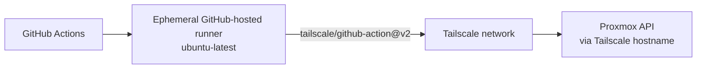

# Step 2 - Secure GitHub Actions runner

GitHub-hosted runners should validate code. They should not reach your private Proxmox host directly.

Real `tofu plan` and `tofu apply` run on **ephemeral GitHub-hosted runners** that join your tailnet temporarily via Tailscale, execute the job, and disconnect when the job ends.

## Runner model



The runner uses `tailscale/github-action@v2` to authenticate with an OAuth client and joins the tailnet for the duration of the job. When the job finishes — success or failure — the runner disconnects automatically.

## Tailscale OAuth client setup

OAuth credentials are preferred over auth keys because they don't expire and don't need periodic rotation.

Create an OAuth client in the [Tailscale admin console](https://login.tailscale.com/admin/settings/oauth):

- The client needs the **"Create ephemeral nodes"** scope.
- Tag the client with `tag:ci-runner` (or your chosen tag).
- Save the **Client ID** and **Client Secret**.

Then set these as GitHub secrets named `TAILSCALE_OAUTH_CLIENT_ID` and `TAILSCALE_OAUTH_SECRET` (see [Step 6 - GitHub Environments](./06-github-environments.md)).

> **Note**: Auth keys still work but need periodic rotation. OAuth credentials are the recommended approach for CI/CD pipelines.

## Tailscale ACL

The tailnet policy must allow the tagged CI runner to reach the Proxmox host on port 8006.

Example ACL snippet:

```json
{
  "acls": [
    {
      "action": "accept",
      "src": ["tag:ci-runner"],
      "dst": ["tag:autolab:80", "tag:autolab:443"]
    }
  ]
}
```

If your Proxmox host is tagged (e.g. `tag:autolab`), the runner needs a route to it. Adjust the ACL to match your tagging scheme. At minimum, the runner needs TCP access to the Proxmox host on port 8006.

## Recommended runner rules

- Use `ubuntu-latest` runners — no self-hosted infrastructure to maintain.
- Use `tailscale/github-action@v2` at the start of any job that needs tailnet access.
- Use GitHub Environments for apply approvals and secrets.
- Use a least-privilege Proxmox API token.
- Keep OpenTofu state, real tfvars, SSH private keys, and generated plans out of git.
- Runners are ephemeral by nature — no cleanup or rotation needed.

## GitHub workflow split

| Workflow | Runner | Secrets? | Purpose |
|----------|--------|----------|---------|
| `opentofu-ci.yml` | `ubuntu-latest` | No | format and static validation |
| `opentofu-plan.yml` | `ubuntu-latest` | Yes | real plan against Proxmox, optional plan artifacts |
| `opentofu-apply.yml` | `ubuntu-latest` | Yes | approved apply from a fresh plan or saved binary plan |

## Caching and artifacts

- Cache OpenTofu provider plugins with `TF_PLUGIN_CACHE_DIR`.
- Key the cache from `.terraform.lock.hcl` when present.
- Upload text plans and logs with short retention.
- Do not upload binary plan files as normal PR artifacts.
- Treat saved plan files as sensitive because they can contain cleartext values.

## Fresh apply vs saved-plan apply

Autolab supports two apply modes:

| Mode | What happens | Use when |
|------|--------------|----------|
| `fresh` | The apply workflow runs a new plan, then applies that exact plan in the same job | Default and recommended |
| `saved-plan` | The apply workflow downloads a binary `tfplan` artifact from a previous plan run | You intentionally want to approve and apply the exact reviewed plan |

Use `fresh` while learning. It avoids the common failure where a saved plan from one workflow run no longer matches the later apply run because provider versions, workspace files, variables, state, or artifacts changed.

Use `saved-plan` only when:

- the plan run was trusted
- the binary plan artifact was uploaded intentionally
- the apply run uses the same environment
- the state has not changed since the plan
- the artifact is still within its short retention window

Saved binary plans are not redacted. Do not publish them broadly.

## Job summaries

Each OpenTofu workflow writes a GitHub job summary:

- CI shows the environment and validation result.
- Plan shows whether changes were detected and whether artifacts were uploaded.
- Apply shows the mode, result, fresh-plan summary when applicable, and final apply summary.

Sources:

- [tailscale/github-action](https://github.com/tailscale/github-action)
- [Tailscale ephemeral auth keys](https://tailscale.com/kb/1111/ephemeral-nodes)
- [GitHub dependency caching](https://docs.github.com/en/actions/using-workflows/caching-dependencies-to-speed-up-workflows)
- [GitHub workflow artifacts](https://docs.github.com/en/actions/how-tos/writing-workflows/choosing-what-your-workflow-does/storing-and-sharing-data-from-a-workflow)
- [GitHub environments](https://docs.github.com/en/actions/reference/deployments-and-environments)
- [OpenTofu CLI config and plugin cache](https://opentofu.org/docs/cli/config/config-file/)
- [OpenTofu plan command](https://opentofu.org/docs/cli/commands/plan/)
