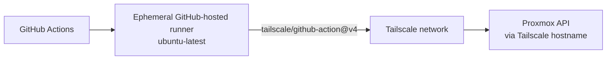

# Step 2 - Secure GitHub Actions runner

GitHub-hosted runners should validate code. They should not reach your private Proxmox host directly.

Real `tofu plan` and `tofu apply` run on **ephemeral GitHub-hosted runners** that join your tailnet temporarily via Tailscale, execute the job, and disconnect when the job ends.

## Runner model


```mermaid
flowchart LR
  GH[GitHub Actions] --> R[Ephemeral GitHub-hosted runner\nubuntu-latest]
  R -- tailscale/github-action@v4 --> TS[Tailscale network]
  TS --> PVE[Proxmox API\nvia Tailscale hostname]
```

The runner joins the tailnet for the duration of the job. When the job
finishes — success or failure — it disconnects automatically.

## Runner authentication

The runner authenticates with a **classic OAuth client**:
`TAILSCALE_OAUTH_CLIENT_ID` + `TAILSCALE_OAUTH_SECRET`, passed to
`connect-tailscale` by every workflow that touches the tailnet. The resulting
runner identity receives exactly `tag:ci-runner`.

That client also carries the `policy_file` scope, because workflow
**06 - Tailscale Policy** reuses it to sync the tailnet policy. See
[tailnet policy GitOps](./tailnet-policy-gitops.md) for the full credential
inventory and the tradeoff that reuse implies.

> **OIDC/WIF is wired but unused.** `connect-tailscale` and
> `setup-opentofu-pipeline` both accept an `audience` input, but no workflow
> passes one and no `TAILSCALE_OIDC_AUDIENCE` variable exists. Earlier
> revisions of this document claimed the runner used OIDC/WIF with no stored
> secret; that was never true. Adopting it would remove
> `TAILSCALE_OAUTH_SECRET` entirely — tracked in
> [issue #4](https://github.com/megamp15/AUTOLAB/issues/4).

### CI runner tag setup

Create a tag named `ci-runner` in the Tailscale admin console. In policy syntax this is `tag:ci-runner`, but the UI may ask for the tag name without the `tag:` prefix.

For **Tag owner**, choose the narrowest owner that should be allowed to assign this tag:

- Personal lab: choose your own identity, for example `<your-github-identity>`.
- Team lab: choose `autogroup:admin` if any tailnet admin should be able to assign it.

Avoid broad owners such as `autogroup:member` for CI/security tags. Do not use `autogroup:tagged` unless you intentionally want already-tagged devices to assign this tag.

Recommended tag-owner policy shape:

```json
{
  "tagOwners": {
    "tag:ci-runner": ["<tailnet-admin-or-approved-wif-principal>"],
    "tag:autolab-vm": ["<tailnet-admin-or-provisioning-authority>"]
  }
}
```

Tag assignment is an authority boundary: only the tailnet administrator or
the explicitly approved provisioning authority may assign these tags. Do not
let Builder VMs assign tags to themselves.

## Tailscale grants and SSH policy

The tailnet policy must allow the tagged CI runner to reach Proxmox on port
8006 and Builder VMs over Tailscale SSH. SSH access must be limited to
`autolab` for bootstrap and `gitops` for regular runs; never grant `root`.

Human operators need a **separate** rule — the CI rule below does not cover
them, and neither does the stock `autogroup:self` rule, because tagged devices
have no owner. See [01 - Tailscale SSH](./01-tailscale-ssh.md).

The live policy is versioned at `infra/tailscale/policy.hujson` and applied by
workflow 06; the snippet below is the runner-relevant excerpt, not the whole
file.

Example policy snippet:

```json
{
  "grants": [
    {
      "src": ["tag:ci-runner"],
      "dst": ["tag:autolab-vm"],
      "ip": ["tcp:22"]
    },
    {
      "src": ["tag:ci-runner"],
      "dst": ["<proxmox-host>"],
      "ip": ["tcp:8006"]
    }
  ],
  "ssh": [
    {
      "action": "accept",
      "src": ["tag:ci-runner"],
      "dst": ["tag:autolab-vm"],
      "users": ["autolab", "gitops"]
    },
    {
      "action": "check",
      "src": ["autogroup:member"],
      "dst": ["tag:autolab-vm"],
      "users": ["megamp15", "autolab", "gitops"],
      "checkPeriod": "12h"
    }
  ]
}
```

CI gets `accept` because it cannot satisfy an interactive browser check;
humans get `check`, which adds an identity-provider re-auth every 12 hours.

Use the Proxmox host's MagicDNS name or address for the `8006` destination. At
minimum, the runner needs TCP access to the Proxmox host on port 8006.

## Recommended runner rules

- Use `ubuntu-latest` runners — no self-hosted infrastructure to maintain.
- Use `tailscale/github-action@v4` at the start of any job that needs tailnet access.
- Use GitHub Environments for apply approvals and secrets.
- Use a least-privilege Proxmox API token.
- Keep OpenTofu state, real tfvars, SSH private keys, and generated plans out of git.
- Before replacing a Builder VM, retire its existing `tag:autolab-vm` device so
  its stable MagicDNS target is not suffixed or stale. Terraform does not
  automatically clean up Tailscale devices; revoke/expire the old enrollment
  key after retirement or destruction.

## GitHub workflow split

| Workflow | Runner | Secrets? | Purpose |
|----------|--------|----------|---------|
| `98_opentofu-ci.yml` | `ubuntu-latest` | No | format and static validation |
| `03_opentofu-plan.yml` | `ubuntu-latest` | Yes | real plan against Proxmox, optional plan artifacts |
| `04_opentofu-apply.yml` | `ubuntu-latest` | Yes | apply from a fresh plan or saved binary plan |
| `05_ansible-builder.yml` | `ubuntu-latest` | Yes | bootstrap as `autolab`, then run regular Builder automation as `gitops` |

**The gate between plan and apply:**

- **Enterprise plans:** use environment "Required reviewers" on `autolab-apply`
- **Free/Team plans:** the apply workflow is `workflow_dispatch` only and requires a manual `confirm: apply` input. You must deliberately run the workflow and type `apply`. That is your human-in-the-loop gate.

## Caching and artifacts

- Cache OpenTofu provider plugins with `TF_PLUGIN_CACHE_DIR`.
- Key the cache from `.terraform.lock.hcl` when present.
- Upload text plans and logs with short retention.
- Do not upload binary plan files as normal PR artifacts.
- Treat saved plan files as sensitive because they can contain cleartext values.

## Fresh apply vs saved-plan apply

Autolab supports two apply modes:

| Mode | What happens | Use when |
|------|--------------|----------|
| `fresh` | The apply workflow runs a new plan, then applies that exact plan in the same job | Default and recommended |
| `saved-plan` | The apply workflow downloads a binary `tfplan` artifact from a previous plan run | You intentionally want to approve and apply the exact reviewed plan |

Use `fresh` while learning. It avoids the common failure where a saved plan from one workflow run no longer matches the later apply run because provider versions, workspace files, variables, state, or artifacts changed.

Use `saved-plan` only when:

- the plan run was trusted
- the binary plan artifact was uploaded intentionally
- the apply run uses the same environment
- the state has not changed since the plan
- the artifact is still within its short retention window

Saved binary plans are not redacted. Do not publish them broadly.

## Job summaries

Each OpenTofu workflow writes a GitHub job summary:

- CI shows the environment and validation result.
- Plan shows whether changes were detected and whether artifacts were uploaded.
- Apply shows the mode, result, fresh-plan summary when applicable, and final apply summary.

Sources:

- [tailscale/github-action](https://github.com/tailscale/github-action)
- [Tailscale OAuth clients](https://tailscale.com/kb/1215/oauth-clients)
- [Tailscale trust credentials scopes](https://tailscale.com/kb/1623/trust-credentials#scopes)
- [Tailscale tags](https://tailscale.com/kb/1068/tags)
- [Tailscale ephemeral auth keys](https://tailscale.com/kb/1111/ephemeral-nodes)
- [GitHub dependency caching](https://docs.github.com/en/actions/using-workflows/caching-dependencies-to-speed-up-workflows)
- [GitHub workflow artifacts](https://docs.github.com/en/actions/how-tos/writing-workflows/choosing-what-your-workflow-does/storing-and-sharing-data-from-a-workflow)
- [GitHub environments](https://docs.github.com/en/actions/reference/deployments-and-environments)
- [OpenTofu CLI config and plugin cache](https://opentofu.org/docs/cli/config/config-file/)
- [OpenTofu plan command](https://opentofu.org/docs/cli/commands/plan/)
