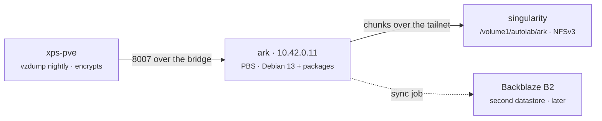

# Backups

Proxmox Backup Server on a managed VM, chunk store on the NAS, an offsite
copy to follow. A backup nobody has restored is a file, so the phase is not
done until a VM has been restored and booted from it once.

## At a glance

`ark` is a Debian 13 clone like every other VM, hardened by `harden.yml`,
with PBS added as packages by the `pbs` role — not the PBS ISO, which has no
cloud-init and would sit outside the baseline. Its datastore is a directory
on the NAS share Builder hosts already mount. The hypervisor sends to it over
the bridge with a client-side encryption key, so the NAS and B2 only ever
hold ciphertext.

## State

| | |
|---|---|
| `ark` | vm 104, `10.42.0.11`, Debian 13, PBS 4 from packages, hardened |
| datastore `singularity` | `/mnt/autolab/ark` on the NAS, NFSv3 over the tailnet, export rule for ark with *No mapping* |
| encryption key | `/etc/pve/priv/storage/ark.enc` on the node; copies in the password manager and R2 (`autolab-keys`) since 2026-09-20 |
| `autolab-nightly` | enabled 2026-09-20, 02:00, every guest except templates 9000/9002 |
| first backup | sputnik, 2026-09-20 06:14 UTC, 3.3 GB of 20 GB written in 5 min |
| first restore | sputnik via `09 - PBS Restore` (test), 2026-09-20 06:30 UTC: `BOOTED as Debian GNU/Linux 13 (trixie)` |
| offsite copy | not yet — B2 as a second datastore, its own PR |
| digest | the 06:00 ntfy digest reports last night's vzdump, each guest's newest backup age, stale/never, storage headroom — see [observability](./observability.md#the-morning-digest) |
| alert | **Backup is missing** (critical, pages) when a running guest the job covers has no backup newer than 26 h; **Backup collector is stale** (warning) guards the collector itself — see [observability](./observability.md#alerting) |

## What lives where

| Thing | Where | Owned by |
|---|---|---|
| The VM | `infra/stacks/lab/machines.auto.tfvars` (`ark`, `builder.backup.server = true`) | OpenTofu |
| PBS, datastore, prune / GC / verify jobs, the `pve@pbs` account | `roles/pbs`, run by `playbooks/backup.yml` | Ansible Builder (05) |
| The `ark` storage on the node, the encryption key, the vzdump job | `roles/proxmox-node/tasks/pbs.yml`, declared in `playbooks/proxmox.yml` | Proxmox Node (07) |
| `PBS_PVE_PASSWORD` | GitHub secret, read by both workflows | you |
| `digest@pbs!obs` token (DatastoreAudit only) | generated by PBS, `/etc/autolab/pbs-digest-token` on ark, copied to the stack host's `/etc/autolab/obs-digest-pbs.env` by `backup.yml` | `pbs` role |
| NFS export rule for ark | NAS → Shared Folder → NFS Permissions | you |
| The encryption key | `/etc/pve/priv/storage/ark.enc` on the node — **and** the password manager **and** R2 | you |

## Bringing it up, in order

1. **Secret.** Create `PBS_PVE_PASSWORD` (repository-level, any long random
   string). It is the password of the `pve@pbs` account; the `pbs` role sets
   it on creation and the node authenticates with it.
2. **The VM.** Merge the machines map change, run `04 - OpenTofu Apply`
   (`lab`), then `05 - Ansible Builder` with `playbook: harden`,
   `bootstrap: true`, `limit: ark`. ark enrols on the tailnet on its own.
3. **The export rule.** On the NAS, add an NFS rule for ark's **tailnet
   address** (`tailscale ip -4` on ark, or the admin console) on
   `/volume1/autolab`: read/write, squash **map all users to admin**. PBS
   runs as the unprivileged `backup` user, and with *no mapping* the share
   root's synthesised mode denies it traversal — see
   [NAS storage](./nas-storage.md#who-can-write). The `pbs` role writes a
   probe file *as that user* before it creates anything, so a wrong rule is
   a readable failure at the top of the run.
4. **PBS.** `05 - Ansible Builder`, `playbook: backup`, `limit: ark`,
   `confirm: check` then `apply`. Mounts the share, installs the server,
   creates the datastore (minutes: 65 536 chunk directories over NFS), the
   jobs and the account. The PBS UI is `https://ark.<tailnet>:8007`
   (`root@pam` with the VM's root password disabled means: log in as
   `pve@pbs` for now, or set a PBS-side root password on the host).
5. **The node.** `07 - Proxmox Node`, `confirm: apply`. Adds the `ark`
   storage with `--encryption-key autogen`, pinning the fingerprint it reads
   from ark over the bridge. The vzdump job is created **disabled**.
6. **The key.** On the node: `cat /etc/pve/priv/storage/ark.enc`. Put it in
   the password manager and in R2. This is the step the whole design hangs
   on: without the key the datastore is noise.
7. **Enable.** Set `enabled: true` on `autolab-nightly` in
   `playbooks/proxmox.yml` in a PR of its own — that PR is the record that
   step 6 happened — and run 07 again. First run: trigger it by hand in the
   PVE UI (Datacenter → Backup → Run now) rather than waiting for 02:00.
8. **Restore.** Workflow **09 - PBS Restore**, `vm: sputnik`, `mode: test`,
   `confirm: RESTORE`. It restores the latest snapshot to a new guest, boots
   it with the network link down, waits for the guest agent, records the OS
   it reports, and destroys it. Not before this passes is the phase done.

Steps 1–8 were done on 2026-09-20. Still open, each its own PR: Backblaze
B2 as a second PBS datastore with a sync job from the NAS one (two secrets:
key ID and application key); an alert on guests without a recent backup and
on failed verify jobs. Run `09 - PBS Restore` with `vm: all` after the first
nightly, then monthly.

## Backing up on demand

Workflow **08 - PBS Backup**: `vm` is a guest name or `all`, `confirm:
BACKUP`. It reads `autolab-nightly`'s storage, mode, compression and
exclude list from the node and runs `vzdump` with exactly those, so an
on-demand run is the nightly at a different hour. A guest asked for by
name is backed up even if the job excludes it — asking by name is the
override. Run it before anything risky, or after a change you want captured
before 02:00. PBS deduplicates, so repeating it costs almost nothing.

## Restoring

Workflow **09 - PBS Restore** is the only way anyone should restore; the
commands it runs are in `roles/pbs-restore`, and nothing about them is worth
remembering under stress.

| Input | Meaning |
|---|---|
| `vm` | a guest name from the machines map, or `all` (test mode only) |
| `mode: test` | restore to a **new** VMID, boot with `link_down=1`, wait for the guest agent, record `get-osinfo`, stop, destroy. 1 GB, 1 core, `onboot 0`, named `<guest>-restore-test`. |
| `mode: replace` | stop the live guest, `qmrestore --force` over it, start it, wait for the agent. One guest only. |
| `snapshot` | a name like `2026-09-20T06:14:36Z`; empty picks the latest |
| `confirm` | `RESTORE` runs it; anything else lists which snapshot would be used and stops |

The link stays down in test mode because the restored disk carries the
original's Tailscale node key; booted online, two machines fight for it and
the live one loses. A test guest can therefore never be reached — the guest
agent is the witness, and `RESTORE RESULT <name>: BOOTED as <os>` in the
run summary is the proof.

Run the test for `all` after any change to the backup path, and on a
schedule you would notice missing (monthly is honest). It takes a few
minutes per guest: reading the snapshot back from the NAS over the tailnet
is the same slow leg as writing it.

## Retention and schedule

| Job | Where | When | Keeps |
|---|---|---|---|
| vzdump `autolab-nightly` | node | 02:00, all guests except the templates and ark itself, snapshot mode, zstd | — |
| prune `singularity-prune` | PBS | 03:00 | 7 daily, 4 weekly, 6 monthly |
| GC | PBS | 03:30 | frees chunks nothing references |
| verify `singularity-verify` | PBS | Saturday 04:00 | re-reads anything not verified in 30 days |

The node never prunes; PBS owns retention. Sizes are set by what four small
guests produce; revisit when a tenant's data grows.

## Things that will mislead you

- **ark must not be in its own backup job.** Snapshot mode freezes the
  guest's filesystems through the agent; a frozen PBS cannot accept the
  connection from the node backing it up, and vzdump waits until
  `backup connect failed: http request timed out`. The first nightly failed
  on exactly this. Nothing on ark needs backing up — chunks are on the NAS,
  the key is off the node, the `pbs` role recreates its configuration — so
  `104` is in the job's `exclude` and the digest lists it as excluded.
- **`pvesm add` refuses the server without a fingerprint, and the one it
  wants is SHA-256 of the certificate PBS generated for itself.** The role
  reads it over the bridge with `openssl s_client` at configure time and pins
  it. If ark is ever rebuilt, its certificate changes and the storage entry
  goes offline until the fingerprint is updated: `pvesm set ark
  --fingerprint <new>`, or remove the storage entry and let the role re-add
  it (the encryption key file is left alone by removal — check before
  re-adding that `/etc/pve/priv/storage/ark.enc` is still there).
- **`--encryption-key autogen` generates a new key only when the storage is
  added.** Re-adding a storage over an existing key file keeps the file. Do
  not delete that file to "reset" anything.
- **The datastore directory must be owned by `backup:backup` and the export
  must let UID 34 write.** Root can create it and the service still fails;
  the probe task exists for exactly this.
- **PBS's chunk store on NFS is officially discouraged for performance.** At
  this size it is fine; when a second node with local disks exists, that is
  where the datastore moves.
