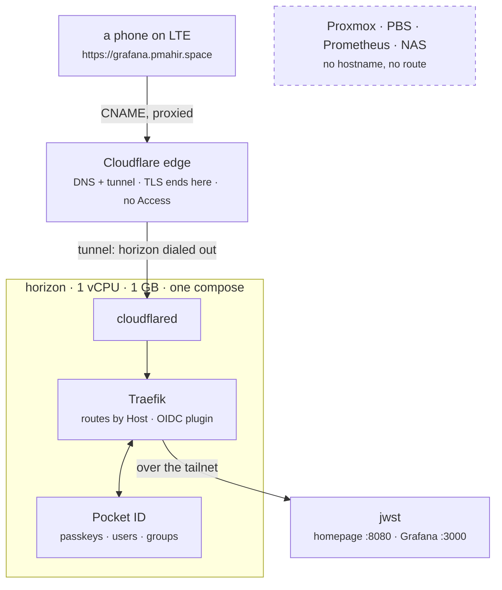

# Ingress

The lab reachable from anywhere, by people you name, with nothing opened on
the router and nothing about the lab visible to anyone who was not let in.
Cloudflare carries the traffic. `horizon` decides who gets in. The services
stay exactly where they are.

## The shape

Three hostnames, one origin. `home`, `grafana` and `auth` under the zone all
CNAME to the tunnel, and every ingress rule in the tunnel hands the request to
`http://traefik:80` inside horizon's compose network. Traefik routes by Host
header and asks Pocket ID who the person is. Anything without a hostname here
has no route: the tunnel's catch-all answers 404 from cloudflared and never
reaches the lab.

Who may enter is decided on horizon, not at Cloudflare. Cloudflare Access was
rejected on purpose: a fifty-seat cap and an emailed code on every login. Pocket
ID has neither. People register a passkey from an invite link and sign in with
Face ID; groups in Pocket ID say which hostnames they may open.

## What is where

| thing | declared in |
|---|---|
| the zone's public records | `infra/stacks/cloudflare/main.tf`, `cloudflare_dns_record` |
| the tunnel and its ingress rules | same stack, `cloudflare_zero_trust_tunnel_cloudflared` and `_config` |
| the hostnames themselves | `infra/stacks/cloudflare/ingress.auto.tfvars` |
| the tunnel token | a sensitive output of the stack; the ingress playbook reads it from state in R2 |
| `horizon` | `infra/stacks/lab/machines.auto.tfvars`, `builder.ingress.stack = true` |
| cloudflared, Traefik, Pocket ID | the `ingress` role, one compose on horizon *(next PR)* |
| users and groups | Pocket ID's admin page, SQLite on horizon, in the nightly backup |

That is the difference from a tunnel clicked together in the dashboard:
routes and records are diffs, and the token is never pasted anywhere.

## Setting it up

One-time, by hand, in the Cloudflare dashboard:

1. **Zero Trust enabled** on the account (Free plan; it asks for a card and
   charges nothing). If the account already has a tunnel, this is done.
2. **An API token, scoped tight.** My Profile → API Tokens → Create Token →
   Custom. Permissions: *Zone → DNS → Edit* and *Account → Cloudflare Tunnel →
   Edit*. Zone resources: the one zone. Account resources: the one account.
   No IP filter (GitHub's runners move). A TTL you will notice expiring.
   → repository secret `CLOUDFLARE_API_TOKEN`.
3. **The zone ID**, from the zone's overview page → repository variable
   `CLOUDFLARE_ZONE_ID`. The account ID is already `CLOUDFLARE_ACCOUNT_ID`.

Then workflow **10 - Cloudflare**: plan by default, `confirm: apply` to
apply. It shares the state bucket and the lock with the Proxmox stacks and
joins neither the tailnet nor Proxmox. After the first apply the names
resolve to Cloudflare and a browser shows Cloudflare's error 1033, *tunnel has
no connector*: correct, and the proof that nothing of ours is reachable until
horizon runs cloudflared.

## Bringing horizon up

Workflow **05 - Ansible Builder**, playbook `ingress`, on `lab`. The job reads
the tunnel token, the zone and the hostname labels from the Cloudflare
stack's state and hands them to the role; the token is masked before
anything can print it. The role brings up one compose on horizon:

| service | reaches | reached by |
|---|---|---|
| `cloudflared` | Cloudflare, outbound | nothing |
| `traefik` | Pocket ID on the compose network; jwst over the tailnet | cloudflared only |
| `pocket-id` | nothing | Traefik only |

No port is published on the host. Two secrets are generated on horizon on
the first run and kept in `/etc/autolab/ingress`: Pocket ID's encryption key
and the OIDC plugin's cookie secret. They live and die with the SQLite next
to them, so they belong on the same disk and in the same nightly backup, not
in GitHub.

After the first run, `https://auth.<zone>` is Pocket ID and `https://home.<zone>`
is a 404 from Traefik. The homepage has no route until its OIDC client
exists, which is the next section. Nothing is ever reachable without a login,
including during setup.

## First login, and the homepage's client

1. Open `https://auth.<zone>`. Pocket ID's first run asks for the first
   admin: a name, an email, and a passkey. Register the passkey on the
   phone; add a second one from a laptop before inviting anyone.
2. *User Groups*: create `admins` and `viewers`. Put yourself in `admins`.
3. *OIDC Clients* → *Add*: name `traefik`, callback URL
   `https://*.<zone>/oidc/callback`, logout callback the same, *Skip
   Consent Screen* on. This one client serves every hostname the plugin
   protects; only apps that speak OIDC themselves (Grafana) get their own.
   Save, open it, *Generate* the secret, copy both.
4. Repository secrets `INGRESS_TRAEFIK_CLIENT_ID` and
   `INGRESS_TRAEFIK_CLIENT_SECRET`. Run the `ingress` playbook again. The
   home route now exists, behind the plugin, allowing `admins` and `viewers`.
5. From a phone on LTE: `https://home.<zone>` → Pocket ID's passkey prompt →
   the homepage. Sign out of Pocket ID, try again as a user in no group:
   403 from Traefik, the homepage never answered.

Inviting someone is Pocket ID's *Users* → *Add* → group → send the setup
link it produces. Removing them from the group is enough; the plugin checks
the groups claim on every login and on every session renewal.

## Grafana

Grafana speaks OIDC itself, so it gets its own client and no plugin in
front. Once its client exists, three things change at once, all from the same
secret: Grafana's root URL becomes `https://grafana.<zone>`, it logs people
in via Pocket ID with `admins` → server admin and everyone else a viewer, and
**anonymous viewing goes off**, tailnet included. A public route plus an
anonymous viewer would be public dashboards. The admin password stays as the
break-glass login. The homepage's Grafana and Loki links switch to the public
name, and it gains a *Pocket ID · sign in* row whose check goes out through
Cloudflare and the tunnel: a red dot there is the tunnel.

1. Pocket ID → *OIDC Clients* → *Add*: name `grafana`, callback URL
   `https://grafana.<zone>/login/generic_oauth`, logout callback
   `https://grafana.<zone>/login`, *Skip Consent Screen* on. Save, open it,
   *Generate* the secret.
2. Repository secrets `GRAFANA_OIDC_CLIENT_ID` and
   `GRAFANA_OIDC_CLIENT_SECRET`.
3. Run **observability** first (Grafana restarts with its login on), then
   **ingress** (the `grafana` route appears). In that order: the route is
   keyed on the same secret, and a route in front of a Grafana that has not
   restarted yet would serve the anonymous viewer to the internet for the
   minutes in between.
4. Proof: `https://grafana.<zone>` → *Sign in with Pocket ID* → passkey (or
   nothing, if the homepage already signed you in) → your name top right,
   *Server Admin*. `http://jwst.<tailnet>:3000` shows the same login page,
   no anonymous dashboards.

## Watching the tunnel

Two watchers, different questions. The homepage's *Pocket ID* row asks
"does the front door answer from the internet?" every minute, through
Cloudflare and the tunnel; red there is the whole path. The **Tunnel is
down** rule asks cloudflared itself: it publishes its metrics on horizon's
loopback, Alloy scrapes them, and `cloudflared_tunnel_ha_connections` at
zero for five minutes pages as critical. The tailnet is never affected by
either; only the public names are.

Proof, as with every rule: on horizon, `sudo docker compose
--project-directory /opt/autolab/ingress stop cloudflared`. Within a minute
the public names answer Cloudflare's 530; at about six minutes the page
arrives; `start cloudflared` clears it.

## Adding a public hostname

A line in `ingress.auto.tfvars` and its Traefik route on horizon. Removing one
is the reverse. The tunnel config's catch-all means a hostname that exists in
DNS but not in Traefik gets a 404, not a service.

## Proxmox and PBS on the same login

Both speak OpenID natively, so neither goes behind the plugin: their login
pages gain a *Pocket ID* realm next to *Linux PAM*. One Pocket ID client
serves both (a client can hold several callback URLs); PVE maps the
`groups` claim to groups named `<group>-pocketid` and the role gives
`admins-pocketid` Administrator on `/`; PBS has no group mapping, so one
named user gets Admin on `/`. Users are created on first login; `root@pam`
is untouched and remains the break-glass login.

1. Pocket ID → *OIDC Clients* → *Add*: name `proxmox`, callback URLs
   `https://xps-pve.lab.<zone>`, `https://xps-pve.lab.<zone>/`,
   `https://pbs.lab.<zone>`, `https://pbs.lab.<zone>/` (PVE and PBS send the
   page's origin, with or without the slash depending on version); *Skip
   Consent Screen* on. Save, open, *Generate* the secret.
2. Repository secrets `PROXMOX_OIDC_CLIENT_ID`, `PROXMOX_OIDC_CLIENT_SECRET`;
   variables `POCKET_ID_URL` (`https://auth.<zone>`) and
   `POCKET_ID_ADMIN_USER` (your Pocket ID username).
3. `07 - Proxmox Node` (check, then apply) for the node; `05` with the
   `backup` playbook for ark. Roles `proxmox-openid` and the `pbs` role's
   `openid.yml` do the work; both list before they add, so re-runs update.
4. Proof: `https://xps-pve.lab.<zone>` → realm *Pocket ID* → *Login* →
   passkey (or silent) → the node, as `<you>@pocketid` with Administrator.
   Same at `https://pbs.lab.<zone>`. Pick the realm once; the browser
   remembers it.

## What was proven, and how

| claim | how |
|---|---|
| nothing listens on horizon | `ss -ltnp`: one published port, `127.0.0.1:2000`, for the local agent |
| an unrouted hostname reaches no service | `home` and `grafana` answered 404 from Traefik until their routes existed; the tunnel's catch-all is `http_status:404` |
| nothing gets past the login | unauthenticated browser → 302 to Pocket ID; non-browser → 401; forged session cookie → 302; nginx on jwst logged zero requests during all of it |
| the login works from the internet | a phone on LTE: `home.<zone>` → passkey → homepage; `grafana.<zone>` → silent, already signed in, Server Admin |
| the tunnel alert pages | `docker compose stop cloudflared`: 530 on every public name within a minute, *Tunnel is down* delivered at +6 min 36 s, resolved 3 min after `start` |
| the homepage watches the door | its *Pocket ID* row probes through Cloudflare every minute; the fire test showed it green on a dead tunnel until the probe named itself (Cloudflare answers a bare Python client with 403) |
| the tailnet side is invisible outside | `dig home.lab.<zone>` answers horizon's address on the tailnet (any other name: REFUSED) and nothing from public resolvers |
| real certificates on the tailnet | every `*.lab.<zone>` name verifies (`ssl_verify_result=0`), `http://` answers 301 to `https://`; the user saw the padlock on `xps-pve.lab` |
| the same login on Proxmox and PBS | realm *Pocket ID* on both login pages; the user signed into each as `megamp15@pocketid` with full rights |

## The tailnet side

Proxmox, PBS, Prometheus and the NAS get no public route, ever. What they get
is the same treatment on the tailnet: a real name, a real certificate, HTTP
bounced to HTTPS, and for the ones with no login of their own, the same
passkey session as the public side.

`*.lab.<zone>` is **not in public DNS.** From the internet the name does not
exist. Inside the tailnet, Tailscale's split DNS sends queries for
`lab.<zone>` to a small resolver (dnsmasq) on horizon's tailnet address,
which answers every name under the label with that same address. The
address is read from `tailscale ip` at deploy time and stored nowhere, so
neither the public tree nor the logs carry it.

Traefik listens on horizon's tailnet address, :443 with one Let's Encrypt
wildcard certificate for `*.lab.<zone>`, :80 only to redirect. The
certificate comes through the DNS challenge, which needs no public record
beyond the TXT Traefik writes and removes itself, using a second Cloudflare
token that can only edit this zone's DNS records: it lives on the exposed
machine, so it can do nothing else.

| name | goes to | login |
|---|---|---|
| `home.lab.<zone>` | the homepage on jwst | the plugin, same session as `home.<zone>` |
| `prometheus.lab.<zone>` | Prometheus on jwst | the plugin |
| `xps-pve.lab.<zone>` | the node's :8006 | Proxmox's own, until it joins the SSO |
| `pbs.lab.<zone>` | PBS on :8007 (ark) | PBS's own, until it joins the SSO |
| `nas.lab.<zone>` | UGOS on :9443 (singularity) | UGOS's own |

Hypervisor nodes are named after themselves, since there can be several and
each is its own place: a second node is `<its-name>.lab.<zone>` with nothing
renamed. Everything else is named for what it is, whichever machine runs it.

Proxmox, PBS and UGOS present self-signed certificates; Traefik does not
verify that hop (tailnet to tailnet, identity is the tailnet's job) and the
browser sees Traefik's real certificate. The plugin's session cookie is set
for the whole zone with one public callback URL, so a login on
`home.<zone>` from LTE is the same session as `home.lab.<zone>` at home.

### Setting it up

1. The DNS-only token: My Profile → API Tokens → Create → Custom → *Zone →
   DNS → Edit*, zone resources *Specific zone → <zone>*, nothing else →
   repository secret `INGRESS_ACME_DNS_TOKEN`. Repository variable
   `INGRESS_ACME_EMAIL` for Let's Encrypt's expiry notices.
2. Run `10 - Cloudflare` (apply) so the stack's `internal_label` output
   exists, then `05` with the `ingress` playbook. horizon installs dnsmasq
   and Traefik requests the certificate; `docker compose logs traefik` on
   horizon shows the ACME exchange.
3. **Tailscale split DNS**, once, in the admin console: DNS → Nameservers →
   *Add nameserver* → *Custom* → horizon's tailnet address, *Restrict to
   domain* `lab.<zone>`. Every tailnet device picks it up through MagicDNS
   with no per-device change. *(The Tailscale provider can manage this; the
   CI OAuth client would need the `dns` scope first — see issue #4.)*
4. Run `05` `observability` so the homepage's rows point at the new names.

Proof: from a tailnet device, `dig home.lab.<zone>` answers horizon's
address; from LTE it answers nothing. `https://xps-pve.lab.<zone>` opens with
a valid certificate and no warning; `http://` redirects to it.
`https://home.lab.<zone>` opens without a prompt if `home.<zone>` already
signed you in.
