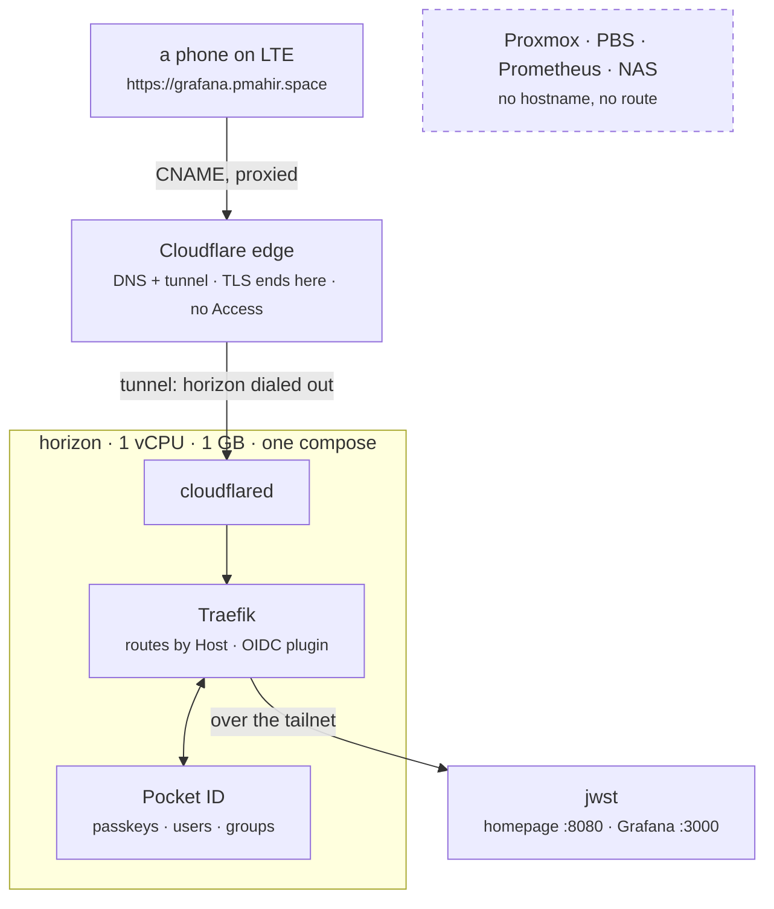

# Ingress

The lab reachable from anywhere, by people you name, with nothing opened on
the router and nothing about the lab visible to anyone who was not let in.
Cloudflare carries the traffic. `horizon` decides who gets in. The services
stay exactly where they are.

## The shape

Three hostnames, one origin. `home`, `grafana` and `auth` under the zone all
CNAME to the tunnel, and every ingress rule in the tunnel hands the request to
`http://traefik:80` inside horizon's compose network. Traefik routes by Host
header and asks Pocket ID who the person is. Anything without a hostname here
has no route: the tunnel's catch-all answers 404 from cloudflared and never
reaches the lab.

Who may enter is decided on horizon, not at Cloudflare. Cloudflare Access was
rejected on purpose: a fifty-seat cap and an emailed code on every login. Pocket
ID has neither. People register a passkey from an invite link and sign in with
Face ID; groups in Pocket ID say which hostnames they may open.

## What is where

| thing | declared in |
|---|---|
| the zone's public records | `infra/stacks/cloudflare/main.tf`, `cloudflare_dns_record` |
| the tunnel and its ingress rules | same stack, `cloudflare_zero_trust_tunnel_cloudflared` and `_config` |
| the hostnames themselves | `infra/stacks/cloudflare/ingress.auto.tfvars` |
| the tunnel token | a sensitive output of the stack; the ingress playbook reads it from state in R2 |
| `horizon` | `infra/stacks/lab/machines.auto.tfvars`, `builder.ingress.stack = true` |
| cloudflared, Traefik, Pocket ID | the `ingress` role, one compose on horizon *(next PR)* |
| users and groups | Pocket ID's admin page, SQLite on horizon, in the nightly backup |

That is the difference from a tunnel clicked together in the dashboard:
routes and records are diffs, and the token is never pasted anywhere.

## Setting it up

One-time, by hand, in the Cloudflare dashboard:

1. **Zero Trust enabled** on the account (Free plan; it asks for a card and
   charges nothing). If the account already has a tunnel, this is done.
2. **An API token, scoped tight.** My Profile → API Tokens → Create Token →
   Custom. Permissions: *Zone → DNS → Edit* and *Account → Cloudflare Tunnel →
   Edit*. Zone resources: the one zone. Account resources: the one account.
   No IP filter (GitHub's runners move). A TTL you will notice expiring.
   → repository secret `CLOUDFLARE_API_TOKEN`.
3. **The zone ID**, from the zone's overview page → repository variable
   `CLOUDFLARE_ZONE_ID`. The account ID is already `CLOUDFLARE_ACCOUNT_ID`.

Then workflow **10 - Cloudflare**: plan by default, `confirm: apply` to
apply. It shares the state bucket and the lock with the Proxmox stacks and
joins neither the tailnet nor Proxmox. After the first apply the names
resolve to Cloudflare and a browser shows Cloudflare's error 1033, *tunnel has
no connector*: correct, and the proof that nothing of ours is reachable until
horizon runs cloudflared.

## Bringing horizon up

Workflow **05 - Ansible Builder**, playbook `ingress`, on `lab`. The job reads
the tunnel token, the zone and the hostname labels from the Cloudflare
stack's state and hands them to the role; the token is masked before
anything can print it. The role brings up one compose on horizon:

| service | reaches | reached by |
|---|---|---|
| `cloudflared` | Cloudflare, outbound | nothing |
| `traefik` | Pocket ID on the compose network; jwst over the tailnet | cloudflared only |
| `pocket-id` | nothing | Traefik only |

No port is published on the host. Two secrets are generated on horizon on
the first run and kept in `/etc/autolab/ingress`: Pocket ID's encryption key
and the OIDC plugin's cookie secret. They live and die with the SQLite next
to them, so they belong on the same disk and in the same nightly backup, not
in GitHub.

After the first run, `https://auth.<zone>` is Pocket ID and `https://home.<zone>`
is a 404 from Traefik. The homepage has no route until its OIDC client
exists, which is the next section. Nothing is ever reachable without a login,
including during setup.

## First login, and the homepage's client

1. Open `https://auth.<zone>`. Pocket ID's first run asks for the first
   admin: a name, an email, and a passkey. Register the passkey on the
   phone; add a second one from a laptop before inviting anyone.
2. *User Groups*: create `admins` and `viewers`. Put yourself in `admins`.
3. *OIDC Clients* → *Add*: name `traefik`, callback URL
   `https://*.<zone>/oidc/callback`, logout callback the same, *Skip
   Consent Screen* on. This one client serves every hostname the plugin
   protects; only apps that speak OIDC themselves (Grafana) get their own.
   Save, open it, *Generate* the secret, copy both.
4. Repository secrets `INGRESS_TRAEFIK_CLIENT_ID` and
   `INGRESS_TRAEFIK_CLIENT_SECRET`. Run the `ingress` playbook again. The
   home route now exists, behind the plugin, allowing `admins` and `viewers`.
5. From a phone on LTE: `https://home.<zone>` → Pocket ID's passkey prompt →
   the homepage. Sign out of Pocket ID, try again as a user in no group:
   403 from Traefik, the homepage never answered.

Inviting someone is Pocket ID's *Users* → *Add* → group → send the setup
link it produces. Removing them from the group is enough; the plugin checks
the groups claim on every login and on every session renewal.

## Grafana

Grafana speaks OIDC itself, so it gets its own client and no plugin in
front. Once its client exists, three things change at once, all from the same
secret: Grafana's root URL becomes `https://grafana.<zone>`, it logs people
in via Pocket ID with `admins` → server admin and everyone else a viewer, and
**anonymous viewing goes off**, tailnet included. A public route plus an
anonymous viewer would be public dashboards. The admin password stays as the
break-glass login. The homepage's Grafana and Loki links switch to the public
name, and it gains a *Pocket ID · sign in* row whose check goes out through
Cloudflare and the tunnel: a red dot there is the tunnel.

1. Pocket ID → *OIDC Clients* → *Add*: name `grafana`, callback URL
   `https://grafana.<zone>/login/generic_oauth`, logout callback
   `https://grafana.<zone>/login`, *Skip Consent Screen* on. Save, open it,
   *Generate* the secret.
2. Repository secrets `GRAFANA_OIDC_CLIENT_ID` and
   `GRAFANA_OIDC_CLIENT_SECRET`.
3. Run **observability** first (Grafana restarts with its login on), then
   **ingress** (the `grafana` route appears). In that order: the route is
   keyed on the same secret, and a route in front of a Grafana that has not
   restarted yet would serve the anonymous viewer to the internet for the
   minutes in between.
4. Proof: `https://grafana.<zone>` → *Sign in with Pocket ID* → passkey (or
   nothing, if the homepage already signed you in) → your name top right,
   *Server Admin*. `http://jwst.<tailnet>:3000` shows the same login page,
   no anonymous dashboards.

## Adding a public hostname

A line in `ingress.auto.tfvars` and its Traefik route on horizon. Removing one
is the reverse. The tunnel config's catch-all means a hostname that exists in
DNS but not in Traefik gets a 404, not a service.

## Not exposed, on purpose

Proxmox, PBS, Prometheus and the NAS keep their tailnet-only addresses. They
get no hostname here. The tailnet policy is their login. Bringing the same
passkey login to them *on the tailnet* is a later step in this phase, and it
still gives them no public route.
