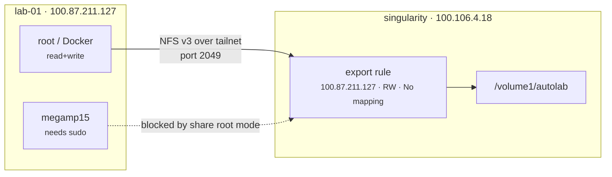

# NAS storage over the tailnet

Builder hosts mount NFS shares from the NAS. Client only — Autolab consumes
shares, it does not export them; the NAS is an appliance.

## At a glance



Nothing authenticates with a password. See *Why there are no credentials*.

## Declaring a mount

`builders/ansible/playbooks/nfs.yml`:

```yaml
autolab_nfs_mounts:
  - server: singularity          # MagicDNS name, never an IP
    export: /volume1/autolab
    path: /mnt/autolab
    owner: megamp15
    group: megamp15
    directories:
      - lab-01
```

Run it with workflow **05 - Ansible Builder**, `playbook: nfs`. Use
`confirm: check` first.

Use the **MagicDNS name**, not a LAN IP. The address then follows the device
rather than the subnet, `/etc/fstab` survives the NAS changing address, and the
traffic stays on the tailnet where the firewall baseline already allows it.

Name the mount point after the **share**, not the device. Hardware gets
replaced and a device-named mount point outlives it — QNTA360 still mounts at
`/mnt/zima-qnta` from a ZimaBoard that no longer serves storage.

## Why there are no credentials

NFS has no username or password. There is nothing to put in a GitHub secret,
and nothing to rotate. Two gates control access:

| Gate | Where | Question |
|---|---|---|
| Export rule | NAS → Shared Folder → NFS Permissions | *Which machines may mount this?* |
| File ownership | ordinary Unix permissions | *Which user may touch this file?* |

The export rule matches on **client IP**. File access matches on **numeric
UID** — with `Squash: No mapping`, the client's UID is passed through untouched
and stored as-is on the NAS. It is never checked against a NAS account.

This is the opposite of SMB, which authenticates a user with a password and
would require a credentials file at `0600` plus a secret to manage.

That trade is only safe because the transport is the tailnet: Tailscale
addresses are bound to node keys, so unlike a LAN, no host can claim
`100.87.211.127` without lab-01's private key. IP-based authentication is
strong here in a way it would not be on a normal network.

**Scope each export to a host, not to `100.64.0.0/10`.** That range is the
entire Tailscale space — every phone, laptop, and future device. Granting it
read-write with no root squash undoes the per-host scoping the tailnet makes
possible. One rule per Builder host is the point, not the overhead.

## Who can write

| Identity | Access |
|---|---|
| root, `sudo` | full |
| Docker containers | full — they run as root |
| systemd services, backups | full |
| an unprivileged user | only if the share root permits traversal |

Unprivileged access needs execute permission on **every** parent directory.
Owning `/mnt/autolab/lab-01` is not enough when `/volume1/autolab` itself
denies traversal — and that is a NAS-side setting no Ansible variable can
reach. `sudo` is the supported path; the share is for workloads, which run as
root anyway.

## Things that will mislead you

These cost real time on this hardware. They are recorded because each one
looked like something else.

**A live mount does not re-check the export rule.** An export can be wrong —
a mistyped address, say `100.87.211.12` for `100.87.211.127` — while `df`,
writes, and the playbook all report healthy. It fails at the next reboot, long
after the change that caused it. Verify a rule change by mounting fresh:

```bash
sudo mount -t nfs -o vers=3,soft,ro singularity:/volume1/autolab /tmp/check
```

**This NAS synthesises POSIX modes from ACLs, and the value moves.** The share
root reports `d---------` at rest and `drwxrwxrwx` shortly after anything
writes to it. `ls -l` on the share is not evidence of anything. Test access by
attempting it, as the user who needs it.

**Root bypasses permission checks, so a writable test run by Ansible proves
nothing about anyone else.** The role's probe writes inside a declared
directory rather than the share root, both because nothing writes to the share
root and because touching it perturbed the mode being measured.

**Confirming a dialog in UGOS can reset the folder's POSIX permissions.** This
happened three times in one session, including after editing an unrelated NFS
rule. Re-check access after any change in that UI.

**The NAS advertises NFSv4 but does not serve it.** `rpcinfo` reports
`version 4 ready and waiting`; mounting v4.2 fails with `No such file or
directory` for both `/volume1/autolab` and `/autolab`. Advertising a version is
not the same as configuring an export for it, so the mount negotiates v3. Do
not add `nfsvers=4` without testing.

## Mount options

Defaults are in `roles/nfs-client/defaults/main.yml`:

```
hard,_netdev,noatime,nosuid,nodev,rsize=131072,wsize=131072,timeo=600,retrans=5
```

`hard` retries indefinitely rather than failing I/O on a blip — correct for
data, where `soft` risks silent corruption mid-write. `_netdev` waits for the
network at boot. `nosuid` and `nodev` mean a setuid binary or device node on
the NAS cannot be used to escalate on the host.

`intr` is deliberately absent. It has been a no-op since Linux 2.6.25 and is
silently ignored, so carrying it implies an interruptibility guarantee that
does not exist.

**`hard` blocks rather than fails when the server is unreachable**, which can
hang a run and leave an fstab entry that stalls the next boot. The role probes
port 2049 first so an offline NAS is a fast, readable failure. For a NAS that
is routinely offline, add to that mount's `options`:

```
x-systemd.automount,x-systemd.idle-timeout=600,x-systemd.mount-timeout=30
```

It then mounts on first access and times out instead of blocking.

## Adding a second Builder host

Two things do not carry over automatically:

1. **A new export rule** on the NAS for that host's tailnet address. Per-host
   scoping means per-host rules.
2. **A matching UID.** NFSv3 with `sec=sys` matches on numbers, so an operator
   account that lands on a different UID writes files the first host cannot
   read. Keep UIDs consistent across Builder hosts, or move to NFSv4 with
   idmapping once the NAS serves an NFSv4 export.

## Unmounting

Set `state: absent` on the entry rather than deleting it — the same reasoning
as operator offboarding. Removing a declaration stops managing it; it does not
undo it.

## Related docs

- [Builder README](../../builders/ansible/README.md) — roles and playbooks
- [01 - Tailscale SSH](./01-tailscale-ssh.md) — the transport
- [Tailnet policy GitOps](./tailnet-policy-gitops.md) — the policy that allows it
