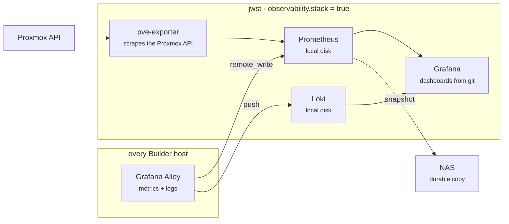

# Observability

Every Builder host runs a collection agent; one host runs the backends it
reports to. Which host is decided by machine policy, not by hostname.

## At a glance



Grafana is reached over the tailnet at `http://<stack-host>:3000`. Nothing is
published to the LAN.

## Why Alloy

[Grafana Alloy](https://grafana.com/docs/alloy/latest/) is a **distribution of
the OpenTelemetry Collector**, not an alternative to it. It wraps upstream
Collector components and adds native Prometheus scrape and service discovery,
which matters because every exporter here is Prometheus-native.

One agent covers metrics, logs, traces and profiles. Tempo and Pyroscope later
are a config addition to this agent, not a re-architecture — which is why the
collection layer was settled before choosing backends.

It also embeds the node exporter, so there is no second package to install or
keep current.

## Why Prometheus and not Mimir

Mimir **requires object storage**. The NAS is the primary storage point and R2
is reserved for the irreplaceable minimum, so running Mimir would mean running
MinIO purely to back a metrics database. Its scale and multi-tenancy solve
problems two VMs do not have.

Metrics stay on **local disk**. A TSDB does heavy random I/O with `mmap` and
file locking; Prometheus documents non-POSIX filesystems as unsupported and a
possible cause of unrecoverable corruption, so the NAS holds *snapshots* rather
than the live database. Snapshots are taken through the admin API — rsyncing a
live TSDB captures half-written blocks and restores to corruption.

If retention ever outgrows local disk, that is the point where MinIO plus Mimir
starts earning its complexity. Because Alloy does the collecting either way,
that migration is a config change.

## Enabling it on a machine

Agents install everywhere automatically. The backends follow machine policy in
`infra/stacks/lab/machines.auto.tfvars`:

```hcl
builder = {
  docker_enabled = true
  observability = {
    stack = true
  }
}
```

Then run workflow **05 - Ansible Builder** with `playbook: observability`.
Use `confirm: check` first.

The stack needs Docker, so `docker_enabled` must be true on the same machine;
the role asserts this rather than failing obscurely later.

## The Proxmox read-only token

Host and guest metrics come from the agents. **Hypervisor** metrics — per-VM
usage as Proxmox accounts it, storage pools, cluster state, backup job status —
come from `prometheus-pve-exporter`, which scrapes the Proxmox **API**. It runs
on the stack host; nothing is installed on Proxmox.

That last category is the gap worth closing: without it, a VM that is powered
off and an agent that has crashed look identical, because both simply stop
reporting.

### Why not reuse `PROXMOX_API_TOKEN`

That token creates and destroys VMs — OpenTofu uses it to do exactly that. Two
reasons to keep the exporter separate:

- **Different lifetimes.** The OpenTofu token exists for the seconds a workflow
  runs. The exporter's sits on disk in a long-running container indefinitely.
- **Different lifecycles.** Rotating or narrowing the OpenTofu token would
  silently break monitoring, and the failure would look like a broken exporter
  rather than a rotated credential.

The exporter is not network-exposed — only Prometheus reaches it, inside the
compose network — so this is defence in depth rather than a live hole. It also
costs about three minutes.

### Create it

On the Proxmox host:

```bash
# 1. A user that exists only to be read from
pveum user add pve-exporter@pve

# 2. A token under it. Prints the secret once — copy it now.
pveum user token add pve-exporter@pve monitoring --privsep 1

# 3. Read-only across the datacenter — BOTH the user and the token
pveum acl modify / --users  'pve-exporter@pve'            --roles PVEAuditor
pveum acl modify / --tokens 'pve-exporter@pve!monitoring' --roles PVEAuditor
```

**Both grants are required, and this is the step that will waste your
afternoon.** With `--privsep 1` a token's effective permissions are the
*intersection* of the user's and the token's. Granting only the token leaves
that intersection empty, so the token authenticates successfully and is then
denied everything:

```
403 Forbidden: Permission check failed (/, Sys.Audit)
```

The ACL looks correct in `pveum acl list` while this is happening, which is what
makes it confusing — the grant is real, it is just being intersected with
nothing.

Privilege separation is still worth keeping. It means the token can never exceed
the user, so narrowing the user later narrows the token automatically. The
alternative, `--privsep 0`, makes the token inherit everything the user has —
exactly the property worth avoiding.

`PVEAuditor` is Proxmox's built-in read-only role: it lists and reads every
node, VM, storage pool and backup job, and changes nothing.

Through the UI instead, all three under **Datacenter → Permissions**:

| Screen | Action |
|---|---|
| **Users** → Add | User name `pve-exporter`, realm `Proxmox VE authentication server`. The form requires a password; token auth ignores it. |
| **API Tokens** → Add | User `pve-exporter@pve`, Token ID `monitoring`, **leave Privilege Separation checked**. Copy the secret. |
| **Permissions** → Add → *User Permission* | Path `/`, user `pve-exporter@pve`, role `PVEAuditor`, Propagate checked |
| **Permissions** → Add → *API Token Permission* | Path `/`, token `pve-exporter@pve!monitoring`, role `PVEAuditor`, Propagate checked |

Both rows, for the intersection reason above.

### Verify it is actually read-only

Check the grant rather than trusting the role name:

```bash
pveum acl list
```

Two lines on `/` with `PVEAuditor` — one `type: user`, one `type: token`. One
alone is not enough; see the intersection rule above.

Then confirm the token resolves to actual permissions rather than an empty set:

```bash
curl -sk -H "Authorization: PVEAPIToken=pve-exporter@pve!monitoring=SECRET" \
  https://<pve-host>:8006/api2/json/access/permissions
```

`{"data":{}}` means the intersection is empty — the user grant is missing.
A populated object listing `Sys.Audit`, `VM.Audit` and friends is correct.

`/nodes` is a poor test here: Proxmox filters that endpoint by permission rather
than denying it, so it returns HTTP 200 with a plausible-looking body even when
the token can see nothing.

### Where the values go

| Name | Kind | Value |
|---|---|---|
| `PVE_EXPORTER_TOKEN_ID` | **variable** | `pve-exporter@pve!monitoring` |
| `PVE_EXPORTER_TOKEN_SECRET` | **secret** | the UUID from step 2 |

The ID is a **variable**, not a secret: it is an identifier, and knowing it
grants nothing without the secret. Secrets are also masked in run logs, so
storing an identifier as one means a failed authentication shows `***` exactly
where you need to see which token was used.

`PROXMOX_HOST` is reused as the scrape target; no new variable is needed.

Leaving these unset is supported — the exporter container is omitted rather
than shipped broken, and everything else works.

## How the secret reaches the host

Workflow 05 renders the values into a `0600` JSON file and passes it with
`--extra-vars @file`. Deliberately not inline: `--extra-vars` on the command
line lands in the runner's process list, and shell interpolation risks the value
reaching the run log. The file is written by Python from environment variables,
so no secret is ever part of a shell string, and removed in an `always()` step.

On the host the token lands in `/opt/autolab/observability/pve.yml` at mode
`0600`, mounted read-only into the container — rather than an environment
variable, which would be visible in `docker inspect` and the container's
process list.

## Dashboards as code

Dashboards live in `roles/observability-stack/files/dashboards/` and are
provisioned with `allowUiUpdates: false`. A dashboard clicked into a container
volume is one disk failure from gone, and cannot be reviewed.

Editing one in the UI would drift from git and be reverted on the next run, so
the provider locks it and says so.

## Network exposure

Container ports bind to the **tailnet address only**, discovered at deploy time.
This is not merely belt-and-braces: Docker writes its own iptables rules ahead
of ufw's, so a port published on `0.0.0.0` is reachable from the LAN **despite**
the baseline's default-deny firewall.

Grafana allows anonymous viewing, which is deliberate — reaching it at all
already required passing the tailnet SSH/ACL policy, and a second password to
lose helps nobody in a single-operator lab. Editing still requires a login.

## Alerting

Five rules ship in `roles/observability-stack/templates/alert-rules.yml.j2`,
provisioned as files for the same reason dashboards are.

| Rule | Fires when | `for` | severity |
|---|---|---|---|
| Guest is stopped but set to start on boot | Proxmox reports a guest down that is flagged `onboot` | 5m | critical |
| Agent is not reporting | Proxmox says the guest runs, but no node metrics arrive | 10m | critical |
| Root filesystem almost full | `/` above `autolab_obs_alert_disk_pct` | 15m | warning |
| Memory nearly exhausted | available memory below `autolab_obs_alert_memory_pct` | 15m | warning |
| Proxmox storage almost full | a PVE datastore above `autolab_obs_alert_pve_storage_pct` | 15m | warning |

Thresholds are deliberately loose. An alert that fires routinely is one people
learn to close without reading, which is worse than no alert.

### Delivery

Rules decide *that* something is wrong. Delivery decides who finds out — and
without it "alerting" means a page you must already be looking at.

`notifications.yml.j2` provisions two contact points and a routing tree:

- **critical** → ntfy priority 5 (long vibration, pop-over), repeats hourly
- **warning** → ntfy priority 3 (normal), repeats every 6h
- **resolved** → priority 2 (silent), on both

The split is the entire point. A channel that interrupts you for a disk at 86%
is a channel you mute, and a muted channel delivers nothing when the thing it
was for finally happens.

Routing is on the `severity` label the rules already set, and the tree is
shallow on purpose: everything lands on *warning* unless explicitly labelled
critical, so a new rule that forgets its label still reaches you — quietly,
which is the safe direction to fail.

**Delivery does not use the tailnet.** It is an outbound HTTPS POST to a third
party, so it still arrives when the tailnet, or `jwst` itself, is the thing that
broke. An alert path sharing a failure domain with the thing it watches is not
an alert path. The cost is that alert *text* — hostnames like `sputnik` — leaves
your network. No IPs, credentials, or metric data do.

### Setting up ntfy

ntfy has no account and no API key. **The topic string is the entire
credential**: anyone who knows it can read your alerts *and publish to them*.
Hence random entropy rather than a memorable name, and hence a secret rather
than a variable.

```bash
# 1. Generate a topic. The random half is what makes it a credential.
echo "autolab-pulsar-$(openssl rand -hex 5)"

# 2. Store it. Never commit it.
gh secret set NTFY_TOPIC

# 3. Subscribe on the phone, then confirm the path end to end from the host.
curl -X POST https://ntfy.sh -H 'Content-Type: application/json' \
  -d '{"topic":"<topic>","title":"test","message":"delivery check","priority":5}'
```

On iOS, prefer the **PWA** — open `https://ntfy.sh` in Safari and Add to Home
Screen — over the App Store app. Upstream describes the native iOS app as
["very bare bones and quite frankly a little buggy"](https://docs.ntfy.sh/faq/)
and iOS development as paused.

### What ntfy cannot do

It has **no iOS Critical Alerts entitlement** ([issue
#1235](https://github.com/binwiederhier/ntfy/issues/1235), open since December
2024), so a priority-5 alert still obeys silent mode, Do Not Disturb, and Focus.
It will not wake you at 3am if your phone is set not to be woken.

That is acceptable while the lab holds nothing you would lose by sleeping
through, and not acceptable after it does. The migration is one file: rules,
severity labels, routing, and dashboards all reference a *receiver name*, not a
service. [Pushover](https://pushover.net/api) has held the Critical Alerts
entitlement since 2020 and supports emergency priority that re-notifies until
acknowledged; swapping to it means rewriting `notifications.yml.j2` and changing
one secret.

### Verifying an alert actually fires

A rule that has never fired is a rule you are trusting on its appearance. Stop
the agent on a VM that Proxmox still sees running — which exercises the whole
chain, including the PromQL join between hypervisor and guest data:

```bash
ssh <vm> sudo systemctl stop alloy
# ~5 min  : Prometheus lookback expires, rule -> pending
# ~10 min : `for: 10m` elapses, rule -> firing, notification sent
ssh <vm> sudo systemctl start alloy   # clears within one evaluation
```

Watch it without guessing:

```bash
curl -s http://<stack-host>:3000/api/prometheus/grafana/api/v1/rules \
  | jq -r '.data.groups[].rules[] | "\(.state)\t\(.name)"'
```

Recorded run: stopped 01:46:05Z, `pending` 01:51:59Z, `firing` 02:02:03Z,
`inactive` 20s after restart. Firing is slow and clearing is instant, by design
— sustained badness pages, a single healthy evaluation clears.

## Things that will mislead you

**`noDataState` defaults to firing when healthy.** Grafana treats an empty
result as a fault. Most of these rules return series *only* when something is
wrong, so the default fires them precisely when nothing is. They set
`noDataState: OK`; genuinely missing metrics are caught by "Agent is not
reporting", whose whole job that is.

**`inactive` means healthy.** Grafana's rule list shows every rule's state, and
five rules sitting at `inactive` is the correct steady state, not five silent
failures.

**HTTP 200 from ntfy does not mean your phone buzzed.** It means ntfy accepted
the message. APNs delivery, the iOS app's known flakiness, and your own Focus
settings all sit downstream of that 200. Confirm on the device.

**Provisioning the policy tree replaces all of it.** Grafana treats the
notification policy tree as one resource, so this file overwrites the default
email policy entirely. Deleting the file does not restore what it replaced —
Grafana keeps the last provisioned tree. That is why no topic means the file is
*removed* rather than rendered empty: an empty tree would route nowhere while
looking configured.

**A container-readable file is not a root-readable file.** Grafana runs as uid
472 and the Proxmox exporter as uid 101. A `0600` root-owned file looks like
the careful choice for something holding a credential, and neither process can
read it. For Grafana this is not a degraded feature — provisioning failure is
fatal, so it crash-loops on startup:
`Failed to provision alerting: ... permission denied`.

**A green deploy does not mean the stack is up.** `docker_compose_v2` with
`state: present` succeeds once containers are *created*, not once they are
healthy, so a crash-looping Grafana leaves a passing workflow behind it. The
role waits on `/api/health` for exactly this reason. `docker logs <name>` is
no safety net either — with the wrong container name it prints
`No such container` to stderr, and a grep for error patterns filters that away
into a clean-looking result.

**Grafana's payload template rejects `:=`.** Variable declarations fail to
parse — `template: :2: unexpected ":=" in command` — and the notifier treats it
as unrecoverable, dropping the alert after one attempt. Nothing about the rule
looks wrong: it evaluates, fires, and shows `firing` in the UI. Only the
delivery is silently lost, and the only evidence is a `ngalert.notifier` line in
the Grafana log. Build payloads from literal JSON with each string value piped
through `data.ToJSON`, not from template variables.

**Agents must start after the backends.** `prometheus.remote_write` retries
indefinitely and recovers on its own; `loki.write` gives up — *"no retries left,
dropping data"* — and does not resume when the backend appears later. The
failure is asymmetric, so metrics look healthy while logs are silently absent.
The playbook runs the stack play first and waits for both backends to report
ready.

**`cache_valid_time` can skip the refresh you just needed.** It means "skip the
update if the cache is younger than this", and `harden.yml` refreshes the cache
minutes earlier in a normal run. A repository added immediately before a package
install is therefore never fetched, and the package appears not to exist. After
adding a repository the refresh has to be unconditional.

**`docker.io` ships no Compose.** Debian packages Compose v2 separately as
`docker-compose`, installed at the CLI plugin path. Without it
`community.docker.docker_compose_v2` refuses to run at all.

**A Proxmox token can authenticate and still be denied everything.** With
privilege separation its permissions are the intersection of the user's and the
token's, so granting only the token yields an empty set. The failure is
`403 Sys.Audit` while `pveum acl list` shows a correct-looking grant. Check
`/access/permissions` — `{"data":{}}` is the tell.

**`apt_repository` needs gpg.** It shells out to `gpg` or `apt-key`, neither
present on a minimal Debian 13 image, and `apt-key` is removed from Debian
entirely. `deb822_repository` writes the sources file directly and is the native
format on this release.

## Related docs

- [NAS storage](./nas-storage.md) — where snapshots land
- [Naming](./naming.md) — why the stack host is called `jwst`
- [GitHub secrets & variables](./github-secrets-variables-reference.md)
