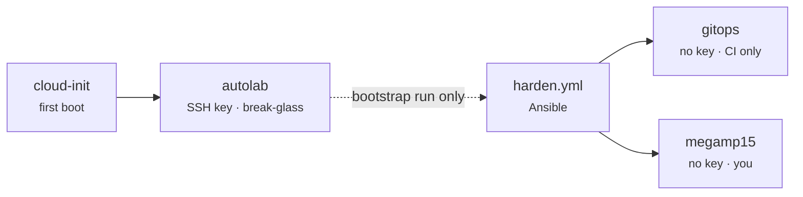

# Server hardening baseline

Every Autolab VM, supported LXC, or VPS should eventually meet the same security
baseline. This doc separates **what ships today** from **what phase 2C Ansible
will enforce later**.

## Implemented today (phase 2A — cloud-init only)

When OpenTofu clones a `builder_target` VM, the `cloud-init` module
(`infra/modules/cloud-init/`) injects on first boot:

| Control | Status today |
|---------|----------------|
| Admin user (`autolab` by default) | Yes — created via cloud-init |
| SSH public keys only for admin user | Yes — human/bootstrap keys from `identity_defaults.ssh_public_keys`; not a CI transport credential |
| Password login for admin user | Locked (`lock_passwd: true`) |
| qemu-guest-agent | Installed and enabled |
| Tailscale enrollment and SSH host feature | Builder VMs receive a unique, non-reusable, preauthorized enrollment key; after enrollment, cloud-init enables Tailscale SSH. Keys expire after 3600 seconds and use the Builder VM tag |
| Resource tags | Yes — per-machine `tags` in `machines` map |
| Unprivileged LXC default | Yes — `proxmox-compute` default for LXC type |

**Not enforced by OpenTofu/cloud-init today:**

- Disable root SSH login
- Separate `gitops` deploy user
- Named human operator accounts (never share `gitops` or `autolab` interactively)
- Firewall (ufw/nftables)
- fail2ban (sshd jail; the hypervisor adds the Proxmox UI jail)
- Security update policy
- Lynis audit
- Tailscale SSH host feature (enabled by cloud-init after enrollment)

Packer-built Debian templates also bake SSH keys into the template and lock the
temporary `packer` user before templating — see `infra/packer/templates/debian-13/`.

## Phase 2C baseline (Ansible)

Ansible roles in `builders/ansible/roles/` now own convergent OS policy after
cloud-init bootstrap. The first run connects as `autolab`; it creates the
`gitops` automation user and the named operator accounts before applying SSH
hardening.

Three account kinds, deliberately not interchangeable:



`autolab` is the only key-bearing account and exists from first boot, so it is
the way in if Tailscale itself is unavailable. `gitops` and operator accounts
have no `authorized_keys` at all and are reachable only over the tailnet. Builder transport is
Tailscale SSH, using the CI runner's existing Tailscale OAuth identity and
tailnet policy. Keep `autolab` as bootstrap/break-glass access.

The universal baseline adds:

| Control | Role |
|---------|------|
| Package refresh + update policy | `base-linux` |
| Human admin user hardening | `base-linux` / `ssh-hardening` |
| `gitops` deploy user + restricted sudo | `gitops-user` |
| Named operator accounts + sudo | `admin-users` |
| Disable root SSH | `ssh-hardening` |
| Disable password SSH | `ssh-hardening` |
| Default-deny firewall | `firewall` |
| Tailscale interface firewall access | `firewall` |
| Optional Docker runtime | `docker-host` via `docker.yml` |
| Tailscale SSH transport | cloud-init after enrollment; tailnet policy |
| Login screen: banner, addresses, updates, reboot, firewall, agent, provisioned commit | `motd` |
| fail2ban: `sshd` jail on every VM (sshd is reachable from bridge neighbours, so this is defence in depth behind key-only auth); `sshd` + Proxmox UI jails on the node. The tailnet range and the node's bridge address are never banned | `fail2ban` |
| Lynis | future |

The login screen is printed by the shell from `/etc/profile.d`, not by PAM:
Tailscale SSH never runs `pam_motd`, so anything under `/etc/update-motd.d`
is only seen over plain OpenSSH. Provider hosts are green, tenant hosts cyan,
so a wrong-window mistake is visible before the first command.

The current implementation supports Debian-family Proxmox Builder VMs. LXC and
VPS support remain deferred until they meet the same reachable-host contract.

Machine-specific exceptions are declared in that machine's OpenTofu `builder`
object. The universal firewall is default-deny; only `builder.firewall_rules`
opens additional inbound ports. Tailscale SSH does not grant access by itself:
the manual tailnet policy must tag the CI runner and Builder VMs, grant runner
reachability, and include SSH accept rules for `autolab` during bootstrap and
`gitops` for later runs.

## What you can verify today

After Packer + local OpenTofu apply with a `builder_target` VM:

```bash
tailscale ssh autolab@<vm-name>          # bootstrap transport
```

After a builder VM is applied:

```bash
tailscale status                         # VM should appear on tailnet
```

## Acceptance checks (phase 2C)

```bash
ssh root@HOSTNAME                        # should fail
ssh -o PreferredAuthentications=password USER@HOSTNAME   # should fail
tailscale ssh autolab@HOSTNAME           # bootstrap; policy must allow it
tailscale ssh gitops@HOSTNAME            # later Builder runs; policy must allow it
sudo ufw status verbose                  # should show active policy
ss -tulpn                                # only expected ports
```

## Public exposure rule

Public internet exposure is opt-in only.

Default management access:

1. Tailscale for reachability and SSH transport (enrollment and host feature via cloud-init).
2. Tailnet policy for the CI runner and Builder VM tags, including SSH accept rules.
3. Proxmox UI over Tailscale/private network.

Do not forward port 22 from the public internet to lab machines by default.

## Related docs

- [GitOps README](./README.md) — phase map (2A vs 2C)
- [OpenTofu VM/LXC provisioning](./04-opentofu-vm-lxc.md) — `machines` and cloud-init
- [builders/ansible/README.md](../../builders/ansible/README.md) — builder scaffold
