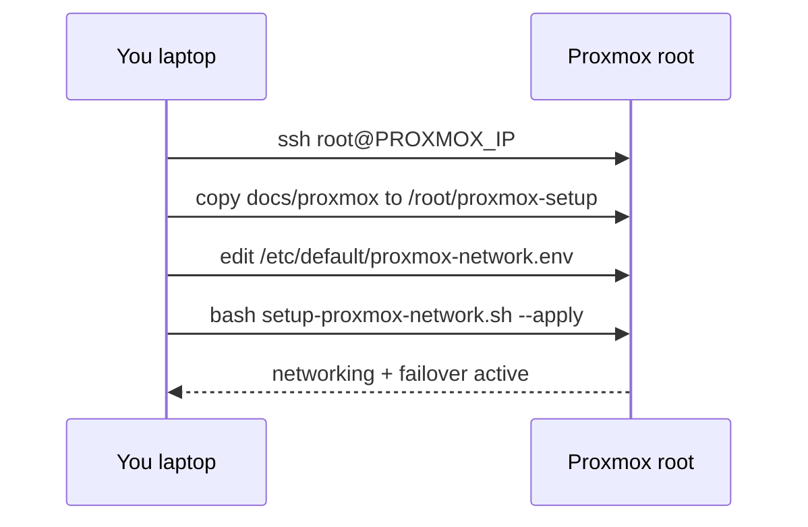
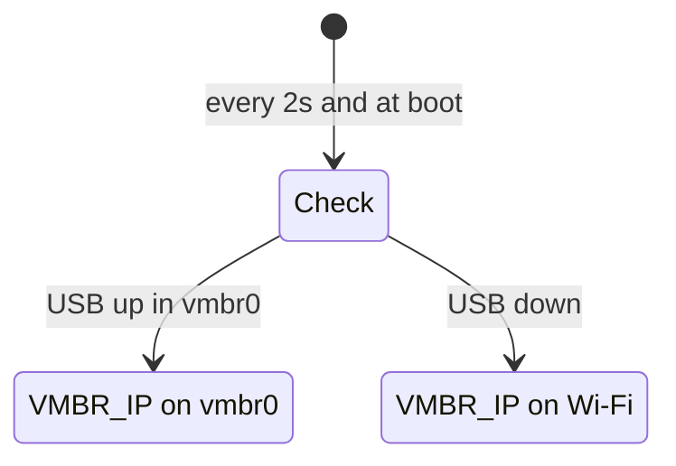

# Step 2 — Network setup over SSH

Do this **after** [Step 1 — Proxmox install](./01-bare-metal-install.md). Log in as **root** on the Proxmox host (SSH from your laptop, or local console).

**Result:** One management IP (`VMBR_IP`, e.g. `192.168.50.130`) on whichever uplink is active — USB Ethernet when plugged in, Wi‑Fi when it is not. Web UI: `https://<VMBR_IP>:8006` (no `/24` in the URL).

> **Before `--apply`:** `setup-proxmox-network.sh --apply` restarts networking and can **drop SSH** if Wi‑Fi fails. Keep **physical console** or [Tailscale](./05-tailscale.md) available. Do not DHCP-reserve `VMBR_IP` on your router for the **Wi‑Fi MAC**.

---

## Overview



| Phase | Where | Action |
|-------|--------|--------|
| A | Laptop | SSH into Proxmox |
| B | Laptop → host | Copy Autolab `docs/proxmox` folder onto the host |
| C | Host | Edit config (your SSIDs, IP, gateway) |
| D | Host | Run installer script (writes `/etc`, `/usr/local/bin`, systemd) |
| E | Host | Verify |

---

## Phase A — SSH into Proxmox

### Find the IP

Use the address from the **Proxmox installer** screen, your router’s DHCP list, or the machine’s display if you have local access.

Example only: `192.168.1.100` — **use your real IP**, not a value from this doc.

### Connect from your laptop

In **Tabby**, **Terminal**, or any SSH client:

```bash
ssh root@PROXMOX_IP
```

Replace `PROXMOX_IP` with your address.

| Prompt | What to do |
|--------|------------|
| `Are you sure you want to continue connecting (yes/no)?` | Type `yes` (first time only) |
| `root@PROXMOX_IP's password:` | Password you set during Proxmox install |

You should see a shell prompt like:

```text
root@pve:~#
```

You are now on the **Proxmox host**, not your laptop. All commands in phases **C–E** run here unless we say “on your laptop”.

### Optional: confirm before copying files

```bash
whoami          # must print: root
ip -br link     # note enx… (USB Ethernet) and wlp… (Wi-Fi) if present
ping -c 2 8.8.8.8   # should work if install networking is up
```

---

## Phase B — Copy `docs/proxmox` onto the host

The scripts **do not run from your laptop**. Copy the folder into **`/root/proxmox-setup/`** on Proxmox.

### Option 1 — USB stick (no SSH file copy)

1. On your laptop, copy the folder `Autolab/docs/proxmox` onto a USB drive.
2. Plug the USB drive into the Proxmox machine (or pass through a VM if applicable).
3. On the host (SSH session):

```bash
mkdir -p /root/proxmox-setup
cp -a /media/usb/path/to/proxmox/* /root/proxmox-setup/
ls /root/proxmox-setup/scripts
```

You should see `setup-proxmox-network.sh` and other `.sh` files.

### Option 2 — `scp` from laptop

**On your laptop** (new terminal tab — not inside the SSH session):

```bash
scp -r /path/to/Autolab/docs/proxmox/* root@PROXMOX_IP:/root/proxmox-setup/
```

Use `proxmox/*` (with the `/*`) so files land in `/root/proxmox-setup/scripts/` directly — not `/root/proxmox-setup/proxmox/scripts/`.

**On the host** (SSH session):

```bash
ls /root/proxmox-setup/scripts/setup-proxmox-network.sh
```

### Option 3 — `git clone` on the host

If the host already has internet and `git`:

```bash
git clone https://github.com/YOUR_ORG/Autolab.git /root/Autolab
mkdir -p /root/proxmox-setup
cp -a /root/Autolab/docs/proxmox/* /root/proxmox-setup/
```

Adjust the clone URL to your repository.

---

## Phase C — Create your config

A beginner only needs to know **Wi‑Fi name and password** (and optional hotspot). Everything else can be **detected** or was set during the Proxmox install.

### What you already know vs what the script finds

| Setting | How you know it |
|---------|------------------|
| **Home Wi‑Fi SSID / password** | Same as your phone or laptop uses at home |
| **Gateway `GW`** | Router IP — often `192.168.0.1` or `192.168.1.1`; Proxmox installer may have used it; script reads current default route |
| **`VMBR_IP`** | Web UI address — script suggests `vmbr0` IP, else Wi‑Fi IP, else gateway subnet + `.130` (e.g. GW `192.168.50.1` → `192.168.50.130/24`) |
| **`ETH_USB` / `WIFI`** | Script lists `enx…` / `wlp…` from `ip link`; if yours differ (`wlan0`, `enp…`), type them at the prompt |

### Option 1 — Interactive helper (recommended)

On the **host** as root:

```bash
cd /root/proxmox-setup/scripts
chmod +x configure-proxmox-network-env.sh
bash configure-proxmox-network-env.sh
```

The wizard writes **`/etc/default/proxmox-network.env`** (not under `/root/proxmox-setup/`). Check it exists:

```bash
ls -la /etc/default/proxmox-network.env
```

To fix a bad password by hand:

```bash
nano /etc/default/proxmox-network.env
```

Use `WPA_HOME_PSK='your-password'` (single quotes, no newline in the value).

It asks for Wi‑Fi (and optional hotspot), auto-detects interfaces and gateway, suggests **management IP** on the same subnet as the gateway (`.130` if nothing is configured yet), writes `/etc/default/proxmox-network.env`, then tells you to run the installer. Press **Enter** to accept detected values.

**Wi‑Fi password safety (automatic):**

| Step | What happens |
|------|----------------|
| `configure-proxmox-network-env.sh` | Strips accidental newlines from typed/pasted passwords and **warns** if it had to |
| `setup-proxmox-network.sh` | **Refuses to run** if `WPA_HOME_PSK` or `WPA_HOTSPOT_PSK` still contains `\n` after loading the env file |

At the hidden password prompt: type the password **once**, then **Enter** (no blank line first). If you edit the env by hand, use `WPA_HOME_PSK='your-password'` — never a bare line like `WPA_HOME_PSK=my pass` (spaces) or `WPA_HOME_PSK=$'\n…'` (newline). See [03-post-install-network-runbook.md](./03-post-install-network-runbook.md#wifi-password-newlines).

### Option 2 — Edit the template by hand

```bash
cp /root/proxmox-setup/config/network.env.example /etc/default/proxmox-network.env
nano /etc/default/proxmox-network.env
```

Use this if you prefer one file in an editor. Replace every `your_home_ssid` / `192.168.1.x` placeholder.

**Router:** Do not DHCP-reserve the same IP for the **Wi‑Fi MAC** that you use as `VMBR_IP` on the bridge.

---

## Phase D — Run the installer on the host

Requires **`/etc/default/proxmox-network.env`** from phase C:

```bash
ls -la /etc/default/proxmox-network.env
cd /root/proxmox-setup/scripts
chmod +x *.sh
bash setup-proxmox-network.sh --apply
```

What this does:

| Output on host | Meaning |
|----------------|---------|
| `/etc/network/interfaces` | Wi‑Fi + `vmbr0` (no `gateway` on bridge) |
| `/etc/wpa_supplicant/wpa_supplicant.conf` | Your SSIDs |
| `/usr/local/bin/network-uplink-failover.sh` | Failover logic |
| `/usr/local/bin/vmbr0-watch.sh` | USB hub replug helper |
| `/etc/default/network-uplink-failover` | Interface names + IP for scripts |
| `systemctl enable …` | Starts at boot |

`--apply` restarts networking; **SSH may drop for a few seconds**. Reconnect with `ssh root@PROXMOX_IP` if needed (or use the same `VMBR_IP` once it is configured).

Backup of old files: `/root/proxmox-network-backup-YYYYMMDD-HHMMSS/`

---

## Phase E — Verify

On the host:

```bash
systemctl is-active network-uplink-failover vmbr0-watch
ip -br addr show dev vmbr0
ip -br addr show dev wlp2s0
ip route get 8.8.8.8
ping -c 2 8.8.8.8
```

| Test | Expected |
|------|----------|
| Both services | `active` |
| Ethernet plugged in | `VMBR_IP` on `vmbr0`; route uses `vmbr0` |
| Ethernet unplugged | `VMBR_IP` on Wi‑Fi; route uses `wlp2s0` |
| Browser | `https://<VMBR_IP>:8006` |

Reboot once to confirm everything comes back without manual steps.

**Cold boot check:** power off fully, unplug USB Ethernet, boot — Wi‑Fi should get `VMBR_IP` and `ping 8.8.8.8` works. Plug USB back in — within a few seconds route should prefer `vmbr0` when link is up.

---

## Scripts by task (not separate “Wi‑Fi vs Ethernet” installs)

One installer applies everything from `/etc/default/proxmox-network.env`. Use these helpers when you only need to change one thing:

| You want | Script | Config file |
|----------|--------|-------------|
| First-time SSID, passwords, IP | `configure-proxmox-network-env.sh` | `/etc/default/proxmox-network.env` |
| Apply config (Wi‑Fi + bridge + failover) | `setup-proxmox-network.sh --apply` | reads env above |
| **Phone hotspot** | Same wizard — answer `y` to “Add phone hotspot?” | `WPA_HOTSPOT_*` in env |
| **More Wi‑Fi networks** (unlimited in wizard) | Same wizard — answer `y` to “Add another Wi-Fi network?” | `/etc/default/proxmox-wifi-extra.list` |
| **USB Ethernet later** (was empty at first run) | `enable-usb-ethernet.sh` | updates `ETH_USB=` then re-runs setup |

### USB Ethernet was empty during the wizard

That is normal if the adapter was unplugged. You still get Wi‑Fi + `vmbr0` with `bridge-ports none`. When the USB NIC is plugged in:

```bash
cd /root/proxmox-setup/scripts
bash enable-usb-ethernet.sh
```

Or by hand: `ip -br link | grep enx` → `nano /etc/default/proxmox-network.env` → set `ETH_USB=enx…` → `bash setup-proxmox-network.sh --apply --skip-apt`.

### “Infinite” Wi‑Fi networks

The wizard loops: home → optional phone hotspot → **Add another Wi-Fi network?** as many times as you want. Extra networks are stored in `/etc/default/proxmox-wifi-extra.list` (`SSID|password|priority` per line) and merged into `wpa_supplicant.conf` on setup via `wpa_passphrase`. Do not use `|` in the SSID.

---

## How failover works



---

## Next steps

| Step | Doc |
|------|-----|
| APT maintenance | [04-apt-maintenance.md](./04-apt-maintenance.md) |
| Tailscale (optional) | [05-tailscale.md](./05-tailscale.md) |
| Problems | [03-post-install-network-runbook.md](./03-post-install-network-runbook.md) |
