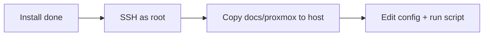

# Step 1 — Install Proxmox on the machine

Install Proxmox VE on internal storage. You will **not** configure USB/Wi‑Fi failover here — that is [Step 2 — network (SSH)](./00-fresh-install-network.md) after you can log in as `root`.

## What you need

- A PC or laptop that will become the hypervisor
- USB flash drive (8 GB or larger)
- [Proxmox VE ISO](https://www.proxmox.com/en/downloads)
- Image writer (e.g. [balenaEtcher](https://etcher.balena.io/))

## BIOS / UEFI (typical)

Labels vary by vendor. Common keys: **F2** setup, **F12** boot menu.

| Goal | Setting |
|------|---------|
| Virtualization | Intel VT-x / AMD-V: **Enabled** |
| Boot from USB | UEFI USB boot **Enabled** |
| Secure Boot | Disable during install if the ISO will not boot |
| Disk mode | **AHCI** / non-RAID is simplest for a single SSD |

## Install from USB

1. Flash the Proxmox ISO to the USB drive.
2. Boot from USB.
3. Run the installer; **the target disk will be erased**.
4. In the installer networking step, pick any working path (onboard Ethernet or Wi‑Fi if offered) so the install can finish. Note the **IP address** shown — you will use it to SSH.

After reboot, open the web UI from another computer on the same LAN:

```text
https://<installer-ip>:8006
```

Accept the self-signed certificate warning (normal on a new install).

## What happens next



| Step | Doc |
|------|-----|
| **2 — SSH + network automation** | [00-fresh-install-network.md](./00-fresh-install-network.md) |
| 3 — APT maintenance | [04-apt-maintenance.md](./04-apt-maintenance.md) |
| 4 — Tailscale (optional) | [05-tailscale.md](./05-tailscale.md) |

[Index](./README.md)
