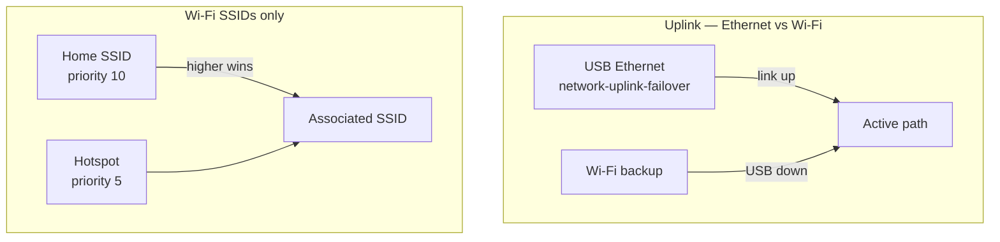

# Wi‑Fi on the Proxmox host

Wi‑Fi is used for **management** (web UI, SSH, `apt`) when USB Ethernet is unavailable. VM bridging over Wi‑Fi is out of scope here; use USB Ethernet on `vmbr0` for guests when possible.

## Setup

Use the automated installer: [00-fresh-install-network.md](./00-fresh-install-network.md).

## Priority (two layers)



| Layer | Config | Rule |
|-------|--------|------|
| Ethernet vs Wi‑Fi | `network-uplink-failover` | USB carrier + bridge port → Ethernet; else Wi‑Fi |
| Home vs hotspot | `wpa_supplicant.conf` `priority=` | **Higher number = preferred** SSID |

## SSID naming

Avoid apostrophes and Unicode quotes in hotspot names. If `scan_results` shows `\xe2\x80\x99`, rename the hotspot to plain ASCII or use a hex SSID in `wpa_supplicant.conf`.

## Quick checks

```bash
source /etc/default/proxmox-network.env
wpa_cli -i "${WIFI}" status
wpa_cli -i "${WIFI}" list_networks
ping -c 2 8.8.8.8
```

## Related

- [03-post-install-network-runbook.md](./03-post-install-network-runbook.md) — `wpa_cli`, troubleshooting
- [05-tailscale.md](./05-tailscale.md) — remote API access
