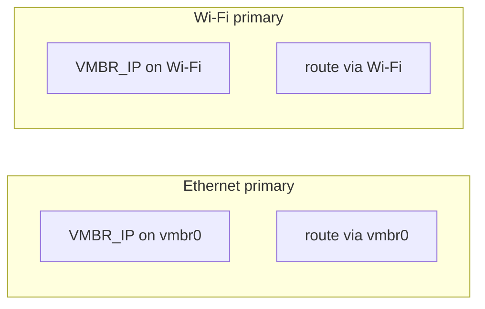

# Network reference and troubleshooting

Use after [00-fresh-install-network.md](./00-fresh-install-network.md). All values below are **examples** — use your `VMBR_IP`, `GW`, and interface names from `/etc/default/proxmox-network.env`.

## File map (on the Proxmox host)

| Path | Purpose |
|------|---------|
| `/root/proxmox-setup/` | Copy of Autolab `docs/proxmox` (optional to keep) |
| `/etc/default/proxmox-network.env` | **Your** SSIDs, IP, gateway, interface overrides |
| `/etc/network/interfaces` | Generated by setup script |
| `/etc/wpa_supplicant/wpa_supplicant.conf` | Generated Wi‑Fi networks |
| `/etc/default/network-uplink-failover` | Variables for failover script |
| `/usr/local/bin/network-uplink-failover.sh` | Failover logic |
| `/usr/local/bin/vmbr0-watch.sh` | USB hub replug helper |
| `/etc/default/proxmox-wifi-extra.list` | Optional extra SSIDs (`SSID\|PSK\|priority` per line) |

Layout reference: [examples/interfaces.example](./examples/interfaces.example)

## Expected behavior



| State | `vmbr0` | Wi‑Fi (`wlp…`) | `ip route get 8.8.8.8` |
|-------|---------|----------------|------------------------|
| USB up, in bridge | `VMBR_IP` | no `VMBR_IP` | `dev vmbr0` |
| USB down | no `VMBR_IP` | `VMBR_IP` | `dev wlp2s0` |

**UI:** `https://<VMBR_IP without /24>:8006`

## Health check

```bash
source /etc/default/proxmox-network.env
systemctl is-active network-uplink-failover vmbr0-watch
grep -c 'dhclient -r "${WIFI}"' /usr/local/bin/network-uplink-failover.sh
ip -br addr show dev vmbr0
ip -br addr show dev "${WIFI}"
ip route get 8.8.8.8
bridge link show
```

## Reinstall scripts from `/root/proxmox-setup`

```bash
source /etc/default/proxmox-network.env
bash /root/proxmox-setup/scripts/refresh-network-scripts-from-repo.sh
```

(`sync-host-to-docs.sh` is an old name that forwards to the same script.)

## Restore from backup

If networking breaks after apply:

```bash
ls -td /root/proxmox-network-backup-* | head -1
# set B=that directory, then:
cp -a "${B}/interfaces" /etc/network/interfaces
cp -a "${B}/wpa_supplicant.conf" /etc/wpa_supplicant/wpa_supplicant.conf 2>/dev/null || true
systemctl restart networking
```

If `systemctl restart networking` fails, try `ifreload -a` (ifupdown2) or reboot from console.

## Interface names not detected

Autodetect expects USB Ethernet `enx*` and Wi‑Fi `wlp*`. If `ip -br link` shows `wlan0` or `enp0s…`, set `WIFI=` / `ETH_USB=` in `/etc/default/proxmox-network.env` and re-run setup.

## Wi-Fi password newlines

Scripts validate `/etc/default/proxmox-network.env` before applying network config.

| Symptom | Cause | Fix |
|---------|-------|-----|
| `line 9: …: command not found` when running setup/configure | `WPA_HOME_PSK` has a space or newline and was not quoted | `nano` → `WPA_HOME_PSK='correct-password'` or re-run `configure-proxmox-network-env.sh` |
| `WPA_HOME_PSK=$'\n…'` in the env file | Extra Enter at hidden prompt, or paste with leading newline | Re-run helper (strips + warns) or fix quoting in `nano` |
| `ERROR: WPA_HOME_PSK … contains a newline` from setup | Env file still invalid after edit | `nano /etc/default/proxmox-network.env` → `WPA_HOME_PSK='…'`, or delete and re-run configure |
| “I don’t see the config file” | Looking under `/root/proxmox-setup/` | Config is **`/etc/default/proxmox-network.env`** — `ls -la /etc/default/proxmox-network.env` |
| `wlp…` DOWN, `wpa_state` not `COMPLETED` | Wrong PSK (often newline variant) | Fix env, then `setup-proxmox-network.sh --apply --skip-apt` |
| “I typed a password but it failed” | Hidden `\n` in value, or Enter used a **broken old** env default | See below — not the same as an empty password |

### “I typed a password” but the next prompt is on the same line

If you see:

```text
Home Wi-Fi password (hidden…): Home priority (higher = preferred) [10]:
```

on **one line**, the wizard was **not** reading your keyboard for the password (bash `read` inside `VAR="$(…)"` bug). The **Enter you pressed on the previous question** (SSID, etc.) could be consumed as the whole “password” (`\n` only). Your real typing then went to the **next** question. Fixed scripts read passwords from `/dev/tty` so that cannot happen.

### `WPA_HOME_PSK` contains a newline

The stored value is literally **newline + text** (bash shows `WPA_HOME_PSK=$'\n…'`). Often caused by the same-line prompt bug above, or paste with a leading newline.

**Prove what is stored** (does not print the password):

```bash
grep '^WPA_HOME_PSK=' /etc/default/proxmox-network.env | cat -A
```

- Good: ends with `'…'$` or `$'…'$` with **no** `^M` or `$` in the middle of the secret.
- Bad: `$'\n…'` or a bare `$` in the middle → fix with `nano /etc/default/proxmox-network.env`.

Check without printing the password:

```bash
grep '^WPA_HOME_PSK=' /etc/default/proxmox-network.env
# Good: WPA_HOME_PSK='secret'  or  WPA_HOME_PSK=$'secret'
# Bad:  WPA_HOME_PSK=$'\nsecret'   or unquoted spaces
```

## Common problems

| Symptom | Fix |
|---------|-----|
| `ping 8.8.8.8` fails, route via `vmbr0`, USB unplugged | Remove `gateway` from `vmbr0` in `interfaces`; enable failover service |
| Both interfaces have `VMBR_IP` | Fix router DHCP; `systemctl restart network-uplink-failover` |
| `enx…` missing | Plug USB hub; `ip -br link \| grep enx`; set `ETH_USB` in env |
| Not in bridge | `ip link set $ETH_USB master vmbr0`; enable `vmbr0-watch` |
| `Unit … does not exist` | Run `setup-proxmox-network.sh` or `install-network-uplink-failover.sh` |

## `wpa_cli`

```bash
source /etc/default/proxmox-network.env
wpa_cli -i "${WIFI}" status
wpa_cli -i "${WIFI}" list_networks
```

## Related

- [README.md](./README.md) · [02-host-networking-wifi.md](./02-host-networking-wifi.md)
