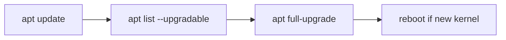

# Step 3 — APT maintenance (ongoing)

Run on the **Proxmox host as root** (SSH) after [Step 2 — network](./00-fresh-install-network.md).

**One-time:** repository setup (§2). **Repeat:** §4 on a schedule.

| Doc | When |
|-----|------|
| [05-tailscale.md](./05-tailscale.md) | Optional, one-time |
| [06-proxmox-version-upgrade.md](./06-proxmox-version-upgrade.md) | Major PVE jump, rare |



## Commands

| Command | Purpose |
|---------|---------|
| `apt update` | Refresh indexes |
| `apt list --upgradable` | Preview |
| `apt full-upgrade` | Install updates (kernels, PVE packages) |

## One-time: no-subscription repos

```bash
grep VERSION_CODENAME /etc/os-release

echo "# enterprise disabled" > /etc/apt/sources.list.d/pve-enterprise.list
echo "# disabled" > /etc/apt/sources.list.d/ceph.list

. /etc/os-release
echo "deb http://download.proxmox.com/debian/pve ${VERSION_CODENAME} pve-no-subscription" \
  > /etc/apt/sources.list.d/pve-no-subscription.list

apt update
```

The Proxmox web UI may show a **subscription** notice; the no-subscription repo is normal for homelab learning. You are not required to purchase a subscription for this guide.

## DNS / network errors

If `apt update` cannot resolve hosts, fix connectivity first ([03-post-install-network-runbook.md](./03-post-install-network-runbook.md)):

```bash
ip route get 8.8.8.8
ping -c 2 "${GW:-YOUR_GATEWAY}"
```

## Regular workflow

```bash
apt update
apt list --upgradable
apt full-upgrade
```

Reboot when a new **proxmox-kernel** was installed. Then:

```bash
pveversion -v
systemctl is-active network-uplink-failover vmbr0-watch
```

Web UI: `https://<your VMBR_IP>:8006`

## Related

- [README.md](./README.md)
