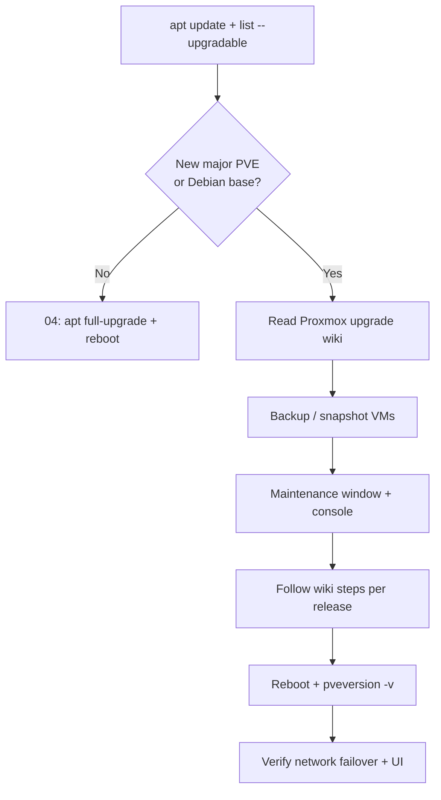

# Proxmox version upgrade (major / uplift)

Use this when moving to a **new major Proxmox VE release**, changing **Debian base** (e.g. bookworm → trixie), or doing a planned **large stack uplift** — not for routine weekly `apt` (see [04-apt-maintenance.md](./04-apt-maintenance.md)).

**Status:** Reference for later. Confirm versions and wiki steps at upgrade time; Proxmox changes release procedures over time.

## Routine vs major

| Type | When | Doc |
|------|------|-----|
| **Routine** | Security fixes, kernel bumps, `pve-*` point releases | [04-apt-maintenance.md](./04-apt-maintenance.md) |
| **Major / uplift** | New PVE major, Debian codename change, cluster-wide coordinated upgrade | This page + official wiki |



## Before you start

1. **Record current state**

   ```bash
   pveversion -v
   grep VERSION_CODENAME /etc/os-release
   ```

2. **Backup** — VM snapshots or backups; note `/etc`, especially:
   - `/etc/network/interfaces`
   - `/etc/wpa_supplicant/wpa_supplicant.conf`
   - `/etc/default/network-uplink-failover`
   - `/usr/local/bin/network-uplink-failover.sh`

3. **Read official docs** for your target release:
   - [Proxmox VE administration — upgrade](https://pve.proxmox.com/wiki/Upgrade) (official wiki)
   - Release notes for the target **pve-manager** version

4. **Access** — physical console or Tailscale ([05-tailscale.md](./05-tailscale.md)); do not rely on a single uplink during first reboot.

## Checklist

- [ ] Repositories match target Debian codename ([04](./04-apt-maintenance.md) §2)
- [ ] `apt update` clean (no 401)
- [ ] VMs: shut down or accept downtime
- [ ] Run upgrade command **specified in wiki** for that jump (often phased `apt` steps, not a blind `full-upgrade` on production clusters)
- [ ] Reboot when prompted; confirm new kernel in UI or `uname -r`
- [ ] `systemctl is-active network-uplink-failover vmbr0-watch`
- [ ] `ip route get 8.8.8.8` on Ethernet and on Wi‑Fi-only
- [ ] UI: `https://<VMBR_IP>:8006`
- [ ] Optional: `tailscale status`

## After a large `full-upgrade` (e.g. Trixie track)

If you already ran a big `apt full-upgrade` (many `pve-*` + new kernels) and apt reported **0 held back**:

- **Reboot** once.
- Treat that as **routine+** unless you intentionally change Debian codename — then still verify against the wiki.

Typical post-upgrade prompts include new **`proxmox-kernel-*`** packages; old kernels can be removed later from the Proxmox UI or `apt autoremove` per wiki guidance.

## What can break custom networking

| Change | Risk |
|--------|------|
| New kernel | USB Ethernet driver, Wi‑Fi firmware — rare; test failover |
| `ifupdown2` / networking package | Review `/etc/network/interfaces` after upgrade |
| systemd | Failover services should remain enabled; `systemctl status` |

Custom scripts under `/usr/local/bin/` are **not** overwritten by `apt`; re-run [refresh-network-scripts-from-repo.sh](./scripts/refresh-network-scripts-from-repo.sh) after updating the Autolab copy on the host.

## Related

- [04-apt-maintenance.md](./04-apt-maintenance.md)
- [00-fresh-install-network.md](./00-fresh-install-network.md)
- [03-post-install-network-runbook.md](./03-post-install-network-runbook.md)
- [README.md](./README.md)
