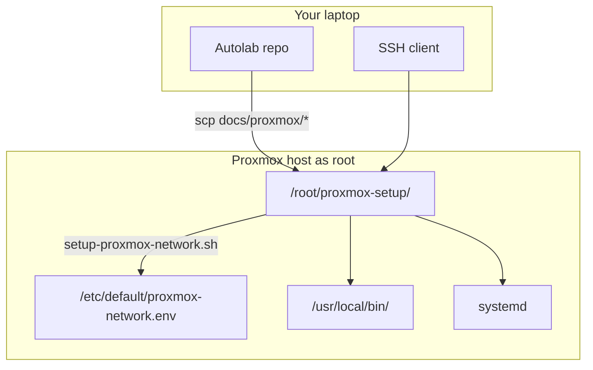

[](../README.md)
[](../../ROADMAP.md)
[](https://github.com/megamp15/AUTOLAB/actions/workflows/scripts.yml)

# Proxmox homelab — documentation

Guides for a **single Proxmox node** with **USB Ethernet** (primary), **Wi‑Fi backup**, and **automatic failover**. Same steps on every machine; **your** SSIDs, passwords, and IPs stay in **`/etc/default/proxmox-network.env`** on the host—not in git.

## Why this layout exists

| Goal | How this repo helps |
|------|---------------------|
| **Learn on real hardware** | Step-by-step install + scripted network (laptop + USB NIC is fine) |
| **Portable lab** | One management IP moves with the active uplink; re-run setup after moving sites |
| **Automation later** | Scripts and env file are the seed for Ansible/Terraform and GitHub Actions ([roadmap](../ROADMAP.md)) |
| **Safe to share** | Repo has placeholders; secrets only on the machine |

## Start here (complete path)



| Step | What you do | Document |
|------|-------------|----------|
| **1** | Install Proxmox from ISO | [01-bare-metal-install.md](./01-bare-metal-install.md) |
| **2** | SSH as root, copy scripts, run wizard + installer | **[00-fresh-install-network.md](./00-fresh-install-network.md)** |
| **3** | `apt` updates (repeat over time) | [04-apt-maintenance.md](./04-apt-maintenance.md) |
| **4** | Tailscale (optional) | [05-tailscale.md](./05-tailscale.md) |
| — | Major version upgrade (rare) | [06-proxmox-version-upgrade.md](./06-proxmox-version-upgrade.md) |

**Reference:** [02 Wi‑Fi concepts](./02-host-networking-wifi.md) · [03 Troubleshooting](./03-post-install-network-runbook.md) · [scripts/README.md](./scripts/README.md)

## Glossary (one minute)

| Term | Meaning |
|------|---------|
| **Wizard** | `configure-proxmox-network-env.sh` — asks Wi‑Fi + optional hotspot/extra SSIDs; writes `/etc/default/proxmox-network.env` |
| **Installer** | `setup-proxmox-network.sh` — reads that env file; writes `/etc/network/interfaces`, `wpa_supplicant`, failover services |
| **`VMBR_IP`** | Proxmox management address (web UI, SSH); usually `.130` on your LAN subnet |
| **`ETH_USB`** | USB Ethernet interface name (`enx…`); empty until you plug in USB or run `enable-usb-ethernet.sh` |

## One config file per machine

```bash
cd /root/proxmox-setup/scripts
bash configure-proxmox-network-env.sh   # creates /etc/default/proxmox-network.env
bash setup-proxmox-network.sh --apply
```

Or copy [config/network.env.example](./config/network.env.example) to `/etc/default/proxmox-network.env` and edit with `nano`.

| Value | You type it? | Auto-detected? |
|-------|--------------|----------------|
| Wi‑Fi SSID / password | **Yes** | Defaults from existing env if re-running wizard |
| Gateway `GW` | Enter to accept | Default route on host |
| `VMBR_IP` | Enter to accept | `vmbr0` IP, else Wi‑Fi IP, else GW subnet `.130` |
| `ETH_USB` / `WIFI` | Optional | First `enx*` / `wlp*` if left empty |

**USB later:** [enable-usb-ethernet.sh](./scripts/enable-usb-ethernet.sh) — see [00-fresh-install-network.md § Scripts by task](./00-fresh-install-network.md#scripts-by-task-not-separate-wi-fi-vs-ethernet-installs).

## What gets copied vs installed

| On Proxmox | What |
|------------|------|
| `/root/proxmox-setup/` | Copy of `docs/proxmox` (scripts + docs; optional to keep) |
| `/etc/default/proxmox-network.env` | **Your** settings (from wizard or template) |
| `/etc/default/proxmox-wifi-extra.list` | Optional extra Wi‑Fi networks from wizard loop |
| `/etc/network/interfaces`, `wpa_supplicant` | **Generated** by installer |
| `/usr/local/bin/*-failover.sh`, `vmbr0-watch.sh` | **Installed** by installer |
| systemd units | **Enabled** at boot |

Git on your laptop is **not** required after copy—only `/root/proxmox-setup/` and what the installer wrote under `/etc` and `/usr/local/bin`.

## Quick commands

**Laptop:**

```bash
scp -r /path/to/Autolab/docs/proxmox/* root@PROXMOX_IP:/root/proxmox-setup/
ssh root@PROXMOX_IP
```

**Host:**

```bash
cd /root/proxmox-setup/scripts
bash configure-proxmox-network-env.sh
bash setup-proxmox-network.sh --apply --skip-apt
# USB Ethernet plugged in later:
bash enable-usb-ethernet.sh
```

Details: [00-fresh-install-network.md](./00-fresh-install-network.md).
