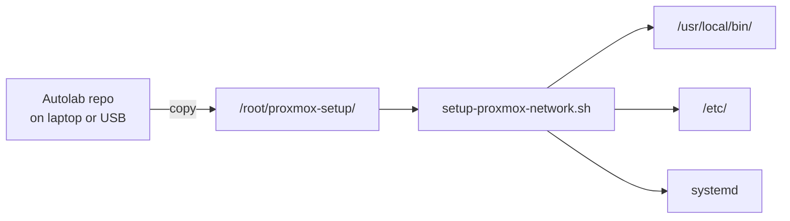

# Scripts — run on the Proxmox host as root

Files in git under `docs/proxmox/scripts/`. They do **nothing** until you copy `docs/proxmox/*` to `/root/proxmox-setup/` on the host and run them as **root**.

## Where they go



| On Proxmox | Path |
|------------|------|
| Copied folder | `/root/proxmox-setup/scripts/*.sh` (+ `scripts/lib/`) |
| Installed by setup | `/usr/local/bin/network-uplink-failover.sh` |
| Installed by setup | `/usr/local/bin/vmbr0-watch.sh` |

## Main scripts (new machine)

```bash
cd /root/proxmox-setup/scripts
bash configure-proxmox-network-env.sh   # Wi-Fi (+ hotspot + more networks); writes /etc/default/proxmox-network.env
bash setup-proxmox-network.sh --apply   # applies Wi-Fi, vmbr0, failover
```

| Task | Script |
|------|--------|
| Home Wi‑Fi + phone hotspot + more SSIDs | `configure-proxmox-network-env.sh` |
| USB Ethernet **after** first run (ETH_USB was empty) | [enable-usb-ethernet.sh](./enable-usb-ethernet.sh) |
| Re-apply after editing env | `setup-proxmox-network.sh --apply --skip-apt` |

Config files on the host:

| Path | Contents |
|------|----------|
| `/etc/default/proxmox-network.env` | Main settings (SSID, PSK, GW, `ETH_USB`, `VMBR_IP`) |
| `/etc/default/proxmox-wifi-extra.list` | Optional extra SSIDs (`SSID\|PSK\|priority` per line) |

Shared libraries:

| File | Role |
|------|------|
| [lib/network-env-validate.sh](./lib/network-env-validate.sh) | Newline checks for Wi‑Fi passwords |
| [lib/proxmox-env.sh](./lib/proxmox-env.sh) | `wpa_passphrase` networks, failover env, `env_file_set` |

## Other scripts

| Script | When |
|--------|------|
| [setup-proxmox-network.sh](./setup-proxmox-network.sh) | **New node** — full install |
| [enable-usb-ethernet.sh](./enable-usb-ethernet.sh) | Plug in USB NIC; set `ETH_USB` and apply |
| [refresh-network-scripts-from-repo.sh](./refresh-network-scripts-from-repo.sh) | Refresh `/usr/local/bin` from repo copy on host |
| [sync-host-to-docs.sh](./sync-host-to-docs.sh) | Deprecated alias → `refresh-network-scripts-from-repo.sh` |
| [install-network-uplink-failover.sh](./install-network-uplink-failover.sh) | Repair failover only (needs env vars) |
| [install-vmbr0-watch.sh](./install-vmbr0-watch.sh) | Repair watch only (needs `ETH_USB`) |

Guide: [../00-fresh-install-network.md](../00-fresh-install-network.md)
